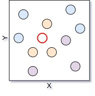
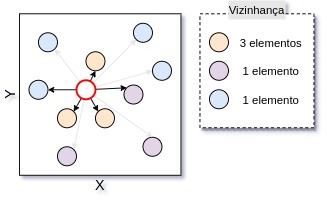

# Classificação

*"Nossas características nos fazem iguais e diferentes ao mesmo tempo"* 

Os algoritmos de Aprendizado de Máquina (AM) supervisionado, apresentados anteriormente, podem ser aplicados para a solução de problemas de Classificação e Regressão. Neste capítulo, serão apresenados os algoritmos de AM para as tarefas de classificação. Para começar, precisamos definir o que é classificação e quais problemas essa pode ser utilizada para resolver. Podemos dizer que classificação é

<!-- ToDo: Buscar uma ideia/pensamento mais simples para explicar essa parte -->
> Processo que busca, através de características já conhecidas de uma entidade, determinar qual sua classe (ou categoria).

Com isso, ao trabalhar com algoritmos de classificação, no contexto de AM supervisionado, estamos preocupados em utilizar algoritmos que permitam com que características já conhecidas sobre um determinado fenômeno possam ser utilizados para a classificação de novos fenômenos em diferentes contextos de uso e aplicação. Essas características fazem com que os algoritmos de classificação sejam empregados nas mais diversas áreas. [@Aggarwal2015] apresenta diversos contextos onde a classificação pode ser utilizada, como a análise de dados biológicos, reconhecimento e filtro de documentos e *e-mails*, além da possibilidade do reconhecimento e diagnóstico de doenças. 

<!-- ToDo: Falar de mais caracteríticas gerais dessa classde algoritmos ? Sim, falar da existência de um processo de treino e teste neste tipo de algoritmo -->
<!-- Se ao final do processo, eu perceber que a descrição de características 'gerais' ajudar no entendimento dos algoritmos, eu coloco aqui um fluxo 'padrão'. Só não coloquei pq não sei a ideia que vou acabar aplicando para a explicação dos algoritmos -->

Dito isto, é importante considerar que, os algoritmos de AM que são empregados para a realização da classificação podem fazer isto através de diferentes técnicas, o que faz com que exista uma gama de diferentes tipos de algoritmos, que através de técnicas variadas, fazem com que o aprendizado acontece e então que a classificação possa ser aplicada. Neste livro, serão apresentados os algoritmos que aplicam técnicas `Probabilísticos`, `Árvores de decisão` e `Instance-based Learning`. 
<!-- O texto que coloquei aqui é apenas um esboço e ainda será refatorado. Isso foi criado desta forma, para que eu consiga desenvolver a apresentação dos algoritmos tendo uma ideia do que tem de ser colocado aqui. -->

<!-- Figura com ícones de probabilidade, árvore de decisão e instance-based learning -->

<!-- Somente três serão apresentados -->
<!-- Acho que isso aqui pode ser substituído por uma figura e então, comentários em cima dela podem ser feitos-->
<!-- Classes de algoritmos: (Modelos probabilisticos; Decision Trees; *Instance-based Learning*) -->
<!-- ***Instance-based Learning*** -->

## *k*-Nearest Neighbors

<!-- Melhorar a explicação dessa parte inicial, falando dos problemas de k vizinhos e etc-->
<!-- Acho que aqui, antes de apresentar um exemplo visual, deve vir uma explicação do algoritmo, tipo: (i) Calcula tal coisa; (ii) Faça outra coisa... Isso ajuda a deixar mais palpável o exemplo visual que está sendo apresentado -->
<!-- A explicação das distâncias também precisa vir aqui, acredito ser bem importante (Falar e mostrar a euclidiana e alguma outra e então, indicar que para cada tipo de problema e dado pode ser aplicada alguma técnica) -->
<!-- Falar aqui da ideia de já ter dados classificados (Facilita para a explicação da clusterização) -->
*k*-Nearest Neighbors (kNN) é um algoritmo de classificação *lazzy learning*, que utilizando das características de vizinhança do elemento que está sendo classificado, atribui a este uma classe. A ideia utilizada para a criação e aplicação dessa técnica é baseada na suposição de que, dados registrados sobre um determinado fenômeno, quando próximos, tendem a representam eventos semelhantes.

<!-- ToDo: Fazer referência cruzada e parar de usar essa coisa de 'a figura abaixo'-->
Para tornar todo o entendimento desse algoritmo mais palpável, vamos considerar um pequeno conjunto de dados de exemplo, este apresentado em um plano cartesiano bidimensional. Nesses dados, apresentados na Figura abaixo, as coordenadas $x$ e $y$ representam as características de um determinado ponto e a cor representa a classe.

Dado este conjunto de dados, vamos fazer a aplicação do kNN para classificar o ponto vermelhor que é apresentado na Figura abaixo

O primeiro passo então é a realização do cálculo da distância entre a amostra que está sendo classificada e todos os pontos presentes no conjunto de dados.

Com a distância calculada, faz-se a determinação dos *k* vizinhos mais próximos. Neste caso, a quantidade de vizinhos buscadas é 4.

Com os vizinhos mais próximos detectados, tem-se definido a vizinhança dos *k* elementos mais próximos do ponto que está sendo classificado naquele momento. Para a definição da classe do ponto que está sendo classificado, faz-se então a contagem da quantidade de elementos que estão presentes e suas respectivas classes.

Então, é feita a determinação da classe do ponto que está sendo classificado através da escolha da classe que mais aparece na contagem, que neste caso é representada pela cor laranja, que possui três elementos.

E é desta forma que os passos que vimos do algoritmo kNN são materializados frente a um conjunto de dados.

<!-- Rascunho do texto base para a apresentação do kNN-->
<!-- Conceitos gerais -->
<!-- $k$-Nearest Neighbors (kNN) é um algoritmo de classificação supervisionado que através da assimilação de elementos já classificados define a classe a qual um determinado elemento vai pertencer. -->
<!-- - Este é um algoritmo que é criado utilizando a ideia base de que os dados que representam fenômenos relacionados e por conta disso, compartilham características. -->
<!--
- Distâncias
  - Euclidean;
  - Mahalanobis
- Complexidade
-->

### Escolha do valor de K

<!--hyperparâmetros, isso já vai ter cido apresentado ao leitor antes ? -->
<!-- Usar da ideia do treino/teste, por isso, esse vai precisar ser adicionado lá em cima -->
Legal! Então o algoritmo é deveras muito simples de ser entendido, tem uma quantidade pequena de passos, todos bem compreensíveis. Mas uma pergunta pode ter surgido durante a explicação do algoritmo, como determinar o valor de *k*. E bem, para esta pergunta existem várias respostas, aqui, será adotada a abordagem da seleção considerando o melhor resultado, assim, durante o processo de treinamento e definição dos hyperparâmetros do kNN, opta-se pela escolha do valor de *k* que apresenta o melhor resultado entre os elementos com classe já conhecida e o resultado que o algoritmo está apresentando.

### Complexidade

Como você pode estar pensando, esse pode não ser um algoritmo computacionalmente muito barato, já que, o cálculo de distância, nesse algoritmo básico que apresentados, é sempre calculado entre o ponto que está sendo classificado, o que se pensarmos em uma quantidade de pontos crescente, como apresentado na Figura abaixo, pode representar um algoritmo com muito tempo para gerar os resultados.

Como forma de reduzir essa complexidade e a quantidade de elementos que precisam ser contabilizados no cálculo da distância, várias implementações aplicam passos de indexação dos dados, com estruturas de dados como a KD-Tree e a Quad-Tree, como é o caso do scikit-learn. Essa abordagem de implementação evita com que todos os pontos tenham de ser calculados, possibilitando assim com que apenas os necessários, neste caso, os mais próximos sejam utilizados nos cálculos de distância.

### Exemplo de uso

<!-- ToDo: Adicionar três figuras nessa parte: (i) Pouca quantidade de pontos; (ii) Quantidade média de pontos; (iii) Grande quantidade de pontos -->

<!-- Isso ajuda a pessoa a entender a escala de crescimento da complexidade -->
<!-- Escolha do K -->
<!-- Visualização do funcionamento -->
<!-- Exemplos de uso  -->

## Árvore de decisão

## Naive Bayes
