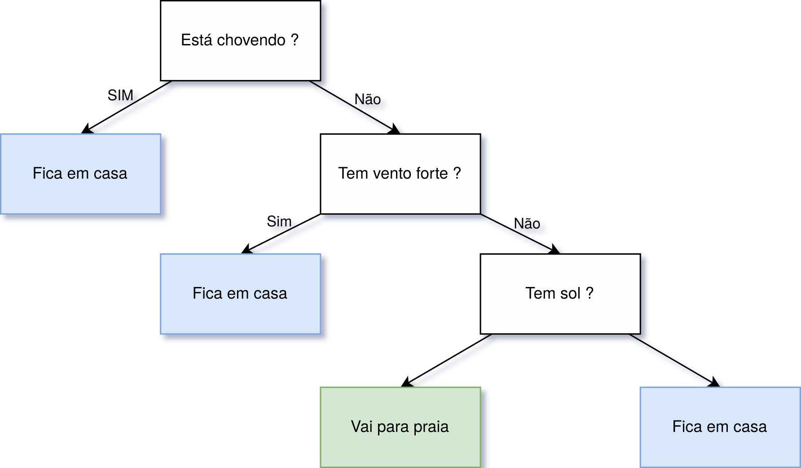

```{r, echo=FALSE}
# Estes comandos não devem ser executados em seu terminal
library(reticulate) 
reticulate::use_miniconda()
# use_condaenv('/home/felipe/anaconda3/envs/rstudio-python-cursoml')
```

# Classificação

*"Nossas características nos fazem igualmente diferentes" - Autor desconhecido* 

- A classificação é um processo feito em duas etapas, aprendizado e previsão.

Os algoritmos de Aprendizado de Máquina (AM) supervisionado, apresentados anteriormente, podem ser aplicados para a solução de problemas de Classificação e Regressão. Neste capítulo, serão apresenados os algoritmos de AM para as tarefas de classificação. Para começar, precisamos definir o que é classificação e quais problemas essa pode ser utilizada para resolver. Podemos dizer que classificação é

<!-- ToDo: Buscar uma ideia/pensamento mais simples para explicar essa parte -->
> Processo que busca, através de características já conhecidas de uma entidade, determinar qual sua classe (ou categoria).

Com isso, ao trabalhar com algoritmos de classificação, no contexto de AM supervisionado, estamos preocupados em utilizar algoritmos que permitam com que características já conhecidas sobre um determinado fenômeno possam ser utilizados para a classificação de novos fenômenos em diferentes contextos de uso e aplicação. Essas características fazem com que os algoritmos de classificação sejam empregados nas mais diversas áreas. [@Aggarwal2015] apresenta diversos contextos onde a classificação pode ser utilizada, como a análise de dados biológicos, reconhecimento e filtro de documentos e *e-mails*, além da possibilidade do reconhecimento e diagnóstico de doenças. 

<!-- ToDo: Falar de mais caracteríticas gerais dessa classde algoritmos ? Sim, falar da existência de um processo de treino e teste neste tipo de algoritmo -->
<!-- Se ao final do processo, eu perceber que a descrição de características 'gerais' ajudar no entendimento dos algoritmos, eu coloco aqui um fluxo 'padrão'. Só não coloquei pq não sei a ideia que vou acabar aplicando para a explicação dos algoritmos -->

Dito isto, é importante considerar que, os algoritmos de AM que são empregados para a realização da classificação podem fazer isto através de diferentes técnicas, o que faz com que exista uma gama de diferentes tipos de algoritmos, que através de técnicas variadas, fazem com que o aprendizado acontece e então que a classificação possa ser aplicada. Neste livro, serão apresentados os algoritmos que aplicam técnicas `Probabilísticos`, `Árvores de decisão` e `Instance-based Learning`. 
<!-- O texto que coloquei aqui é apenas um esboço e ainda será refatorado. Isso foi criado desta forma, para que eu consiga desenvolver a apresentação dos algoritmos tendo uma ideia do que tem de ser colocado aqui. -->

<!-- Figura com ícones de probabilidade, árvore de decisão e instance-based learning -->

<!-- Somente três serão apresentados -->
<!-- Acho que isso aqui pode ser substituído por uma figura e então, comentários em cima dela podem ser feitos-->
<!-- Classes de algoritmos: (Modelos probabilisticos; Decision Trees; *Instance-based Learning*) -->
<!-- ***Instance-based Learning*** -->

## *k*-Nearest Neighbors

Para começar, o primeiro algoritmo que vamos tratar será o *k*-Nearest Neighbors (kNN), um algoritmo de classificação *lazzy learning*, que através da análise de vizinhança de amostras de um determinado conjunto de treinamento, define o rótulo de classe das amostras do conjunto de teste. De maneira geral, o que o algoritmo faz é buscar os elementos que estão próximos à amostra que está sendo classificada, e com base nessas amostras que estão próximas faz a classificação. Então, aqui temos uma mistura de conceitos, vamos começar primeiro resumindo o algoritmo em uma frase:

> Me diga com quem tu andas, que eu digo quem tu és

Essa frase ajuda muito a assimilar a ideia geral do algoritmo, mantenha ela em mente durante essa seção. Agora, precisamos entender que o kNN é dividido em duas partes principais: (i) Análise de vizinhança; (ii) Determinação do rótulo da classe. Vamos começar pela primeira parte.

- (i) Análise de vizinhança; 

Nesta parte do algoritmo o que se busca é determinar quem são as amostras do conjunto de treinamento que estão mais próximas da amostra de teste que está sendo classificada. Certo, mas nesse caso, o que é "estar próximo" ? De maneira intuitiva, a ideia de proximidade está relacionada a distância, e é exatamente dessa forma que o algoritmo, nesta etapa, faz a determinação dos elementos próximos, para isso, utiliza várias funções de distância. Um exemplo de função de distância é a `Distância Euclidiana`, sim! a mesma que utilizamos para várias partes de nossas vidas para manipulação de elementos no espaço euclidiano. Você lembra de usar ela para calcular a distância entre dois pontos ? Vamos olhar a fórmula para relembrar

Então, a `Distância euclidiana` é apresentada da seguinte forma

<center>
$\sqrt{\sum_{i = 1}^{n} (p_i - q_i)^2}$
</center>

Assim, através dessa função o algoritmo determina os elementos que estão mais próximos de uma determinada amostra. Cabe lembrar que, essa não é a única função, várias outras podem ser utilizadas. Agora, podemos ir para a segunda parte, vamos lá!

- (ii) Determinação do rótulo da classe.

> Para entender esta segunda parte, devemos nos lembrar que, esse algoritmo é um algoritmo supervisionado, então, quando estamos falando do conjunto amostral de treino, estamos assumindo que esses dados já possuem um rótulo definido e que esses rótulos serão utilizados no processo de classificação dos dados que não tem rótulo. Feito esse lembrete, vamos continuar!

Nesta parte do algoritmo, após calcular a distância de cada um dos pontos, ele escolhe os *k* elementos mais próximos. Com a determinação desses elementos mais próximos, o algoritmo analisa e contabiliza, por classe, quantos são os elementos que compoem a vizinhança, dessa forma, ao final desse processo, o algoritmo sabe quais são as classes vizinhas da amostra a ser classificada e quantos elementos de cada uma dessas classes estão presentes na vizinhança. Feito isso, o algoritmo vai determinar o rótulo da amostra a ser classificada como sendo igual a classe, que na vizinhança possui a maior quantidade de elementos. Somente isso! Viu que interessante, esse é um algoritmo simples e que pode ser muito eficiente dependendo do contexto de uso. 

Mas espera ai, você pode estar se perguntando, "E a ideia do treino e teste que foi falada antes?", bem, esse é um algoritmo de classificação *lazzy learning* lembra ? Ou seja, a parte de treinamento é resumida em apenas organizar ou armazenar os dados, de modo a deixar eles pronto para o uso.

<!-- Melhorar a explicação dessa parte inicial, falando dos problemas de k vizinhos e etc-->
<!-- Acho que aqui, antes de apresentar um exemplo visual, deve vir uma explicação do algoritmo, tipo: (i) Calcula tal coisa; (ii) Faça outra coisa... Isso ajuda a deixar mais palpável o exemplo visual que está sendo apresentado -->
<!-- A explicação das distâncias também precisa vir aqui, acredito ser bem importante (Falar e mostrar a euclidiana e alguma outra e então, indicar que para cada tipo de problema e dado pode ser aplicada alguma técnica) -->
<!-- Falar aqui da ideia de já ter dados classificados (Facilita para a explicação da clusterização) -->
<!-- *k*-Nearest Neighbors (kNN) é um algoritmo de classificação *lazzy learning*, que utilizando das características de vizinhança do elemento que está sendo classificado, atribui a este uma classe. A ideia utilizada para a criação e aplicação dessa técnica é baseada na suposição de que, dados registrados sobre um determinado fenômeno, quando próximos, tendem a representam eventos semelhantes. -->

<!-- ToDo: Fazer referência cruzada e parar de usar essa coisa de 'a figura abaixo'-->
<!-- Para tornar todo o entendimento desse algoritmo mais palpável, vamos considerar um pequeno conjunto de dados de exemplo, este apresentado em um plano cartesiano bidimensional. Nesses dados, apresentados na Figura abaixo, as coordenadas $x$ e $y$ representam as características de um determinado ponto e a cor representa a classe. -->

Agora, com o objetivo de deixar tudo mais claro, vamos para um exemplo visual, passo a passo da execução do algoritmo! Então, vamos começar considerando que o nosso conjunto amostral é formado por um grupo de pontos de várias cores, onde as cores representam os rótulos de cada um desses pontos e então, a ideia vai ser aplicar o kNN para determinar o rótulo de um novo ponto com base nesse conjunto já existente.

> Veja aqui que os pontos que já existem representam o conjunto de treino, e o ponto que será classificado, representa o conjunto de teste

Os pontos de treinamento são apresentados abaixo

<center>

</center>

Beleza! Então, com esse conjunto de dados, vamos adicionar um novo ponto, este é representado pelo ponto vermelho na figura abaixo. Perceba que, este é uma amostra que representa o conjunto de teste, e que, ao ser inserido neste espaço, ele não possui nenhum rótulo definido.

<center>

</center>

Certo! Então já temos nosso problema de classificação definido, vamos resolver ele com o kNN. Aqui, o valor de *k* = 5 (Não se preocupe, vamos voltar nesse valor de *k* depois), ou seja, na primeira parte do algoritmo, análise de vizinhança, vamos buscar os 5 elementos mais próximos ao ponto vermelho.

Feito essas considerações, vamos de maneira manual fazer a aplicação do algoritmo, começando com o primeiro passo, de análise de vizinhança, feito com o cálculo das distâncias. Aqui, você vai perceber que a distância utilizada foi a euclidiana, que apresentamos anteriormente.

<center>

</center>

Com as distâncias calculadas a segunda parte do algoritmo, de determinação do rótulo com base nos vizinhos pode ser iniciada. Para isso, primeiro faz-se a seleção dos 5 elementos mais próximos.

<center>

</center>

Com os vizinhos mais próximos determinados, é feito a contagem desses, separando cada um desses por rótulo, de modo que, a vizinhança é sumarizada em quantidade de elementos por rótulo, como apresentado abaixo.

<center>

</center>

Então, é feita a determinação do rótulo do ponto que está sendo classificado, que como podemos ver, vai receber o rótulo laranja, uma vez que, esta é a classe que mais aparece na vizinhança do ponto vermelho.

<center>

</center>

É desta forma que os passos que vimos do algoritmo kNN são materializados frente a um conjunto de dados. Viu que legal! O que o algoritmo faz é exatamente aquilo que está na frase que apresentamos antes.

<!-- Rascunho do texto base para a apresentação do kNN-->
<!-- Conceitos gerais -->
<!-- $k$-Nearest Neighbors (kNN) é um algoritmo de classificação supervisionado que através da assimilação de elementos já classificados define a classe a qual um determinado elemento vai pertencer. -->
<!-- - Este é um algoritmo que é criado utilizando a ideia base de que os dados que representam fenômenos relacionados e por conta disso, compartilham características. -->
<!--
- Distâncias
  - Euclidean;
  - Mahalanobis
- Complexidade
-->

### Escolha do valor de K

<!--hyperparâmetros, isso já vai ter cido apresentado ao leitor antes ? -->
<!-- Usar da ideia do treino/teste, por isso, esse vai precisar ser adicionado lá em cima -->
Legal! Então o algoritmo é deveras muito simples de ser entendido, tem uma quantidade pequena de passos, todos compreensíveis. Mas uma pergunta pode ter surgido durante a explicação do algoritmo, como determinar o valor de *k*. E bem, para esta pergunta existem várias respostas, aqui, será adotada a abordagem da seleção considerando o melhor resultado, assim, durante o processo de treinamento e definição dos hyperparâmetros do kNN, opta-se pela escolha do valor de *k* que apresenta o melhor resultado entre os elementos com classe já conhecida e o resultado que o algoritmo está apresentando. 

Outras abordagens baseadas em otimizações também podem ser uma saída para este caso, mas essas, não serão abordadas neste livro introdutório.

### Complexidade

Como você pode ter pensando, esse pode não ser um algoritmo computacionalmente muito barato, já que, o cálculo de distância nesse algoritmo que apresentamos, é sempre calculado entre todos os pontos do conjunto de treinamento com o conjunto de teste, o que se pensarmos em apenas poucas quantidades de pontos pode não ser um problema, mas que, com a crescente na quantidade, pode ser inviável. Para isso, considere a Figura abaixo, imagina que o ponto vermelho vai ser classificado, a distância dele para todos os outros pontos terá de ser determinada.

<center>

</center>

Como forma de reduzir essa complexidade e a quantidade de elementos que precisam ser contabilizados no cálculo da distância, várias implementações aplicam passos de indexação dos dados, com estruturas de dados como a KD-Tree ou a Quad-Tree, como é o caso do scikit-learn. Essa abordagem de implementação evita com que todos os pontos tenham de ser calculados, possibilitando assim com que apenas os necessários, neste caso, os mais próximos sejam utilizados nos cálculos de distância.

### Exemplo de uso

<!-- ToDo: Verificar e mover para a introdução -->
Como foi possível perceber o kNN é um algoritmo simples e pode ser implementado facilmente em linguagens como Python e R, mas, não há a necessidade da implementação do zero desse e dos demais algoritmos apresentados neste livro, há diversas bibliotecas que podem ser utilizadas para facilitar todo o processo aplicação do algoritmo. Assim, esta seção vai fazer o uso da biblioteca scikit-learn e do pacote class para realizar a aplicação do kNN.

Para começar, os dados utilizados estão disponíveis no arquivo knnpoints.csv e a visualização desses está disponível na Figura abaixo

<center>

</center>

Abaixo é apresentado a maneira a qual o scikit-learn é importado para ser utilizado

```{python}
from sklearn.neighbors import KNeighborsClassifier
```

#### Exemplo 1

```{python}

```

<center>

</center>

#### Exemplo 2

<center>

</center>

#### Exemplo 3

<center>

</center>

<!-- ToDo: Adicionar três figuras nessa parte: (i) Pouca quantidade de pontos; (ii) Quantidade média de pontos; (iii) Grande quantidade de pontos -->
<!-- Isso ajuda a pessoa a entender a escala de crescimento da complexidade -->
<!-- Escolha do K -->
<!-- Visualização do funcionamento -->
<!-- Exemplos de uso  -->

## Árvore de decisão

*"O importante é não deixar de fazer perguntas"* - Albert Einstein

A árvore de decisão é um dos algoritmos mais utilizados na área de Aprendizado de Máquina, isso por apresentar bons resultados em diversos contextos e por ser considerado um método *transparente*, por deixar explícito as regras que estão sendo utilizadas para a tomada das decisões e geração dos resultados. No capítulo anterior, esta classe de algoritmos foi apresentada para a solução dos problemas de regressão, aqui, eles serão postos no contexto de classificação.

### Conceitos gerais

As árvores de decisão são fundamentalmente formas de representação de conhecimento através de uma estrutura hierarquica de perguntas na forma *if-then-else*. Isso faz com que a estrutura das árvores de decisão sejam semelhantes a um fluxograma, onde existem nós que são utilizados para representar as perguntas e desses são derivados outros nós, que podem representar a resposta ou mesmo outra pergunta. Essa estrutura é apresentada na Figura \@ref(fig:class_dt1).

```{r fig:class_dt1, echo=FALSE, fig.align='center', out.width = "75%", fig.cap='Árvore de decisão - Fonte: Produção do autor'}
knitr::include_graphics("assets/1_classification/2_decision-tree/01_dt.png")
```

Para nos familiarizarmos com os conceitos que estão envolvidos nessa representação, vamos olhar com calma cada um dos detalhes presentes na figura. Primeiro, a leitura desse tipo de árvore é feita sempre de cima para baixo já que a raiz da árvore está sempre no topo, como é o caso da `Pergunta 1` neste exemplo. Além disso, note também que nessa estrutura existem dois tipos de elementos, as `Perguntas` e as `Respostas`, onde, das `Perguntas` podem sair outras dessas ou mesmo `Respostas`. As `Respostas` representam elementos finais e quando aparecem nada pode ser inserido abaixo. Outra coisa importante de ser citada é a característica recursiva das árvores de decisão, nessas, para cada ramo que é seguido após uma pergunta há uma nova árvore, que é criada através das mesmas regras de definição aplicadas na árvore anterior.

Antes da aplicação em larga escala dos algoritmos de AM, essas estruturas já eram utilizadas, porém, com a diferença de que toda a sua criação era feita manualmente, através da aplicação do conhecimento vindo de pesquisas e experimentos empíricos. Por exemplo, um banco, antes do Aprendizado de Máquina, ao querer ser mais acertivo nos empréstimos e diminuir a inadimplência, poderia utilizar de seu histórico de empréstimos e criar regras consultáveis que poderiam ser utilizadas como auxílio aos operadores que realizam empréstimos. A representação das regras definidas poderia ser feita através de uma árvore de decisão sem problemas, mas, isso não caracterizada nada de aprendizado de máquina, já que todo o 'processo de aprendizado' foi feito manualmente por pessoas.

Ao contrário disto, as árvores de decisão no contexto de AM são as responsáveis em olhar para os dados e decidir quais são as perguntas mais adequadas para uma determinada resposta. Isso é feito no algoritmo através de sucessivas divisões no conjunto de dados, de modo que, em cada divisão tem-se novos elementos adicionados na árvore. Para essa ideia ficar clara, vamos começar com um exemplo, neste, há um conjunto de pontos, onde cada cor representa uma classe. A árvore de decisão será treinada com esses dados de modo que novas classificações com base neste treinamento possam ser realizadas. O conjunto de dados e a representação da árvore são feitos na Figura \@ref(fig:class_dt2).

```{r fig:class_dt2, echo=FALSE, fig.align='center', out.width = "75%", fig.cap='Conjunto de dados 1 - Fonte: Produção do autor'}
knitr::include_graphics("assets/1_classification/2_decision-tree/02_dt.png")
```

Com o conjunto de dados definido, o primeiro passo realizado pela árvore é avaliar quais são as características que melhor definem uma determinada classe. Após fazer isso, a árvore cria uma pergunta que faz com que essa característica identificada como a melhor possa ser utilizada para a divisão do conjunto de dados. Neste caso, a árvore identificou que o conjunto de pontos da classe `Vermelha` estão majoritariamente nas posições com X acima de 10, então, é criada uma pergunta na árvore que verifica quais elementos são maiores que dez, ao fazer isso a divisão do conjunto de dados é realizada e então novos nós são adicionados na árvore, veja na Figura \@ref(fig:class_dt3).

```{r fig:class_dt3, echo=FALSE, fig.align='center', out.width = "75%", fig.cap='Conjunto de dados 2 - Fonte: Produção do autor'}
knitr::include_graphics("assets/1_classification/2_decision-tree/03_dt.png")
```
Se lembrarmos a definição feita anteriormente, temos que as árvores de decisão são estruturas recursivas, então, a mesma lógica de busca do elemento que melhor descreve um conjunto de dados e então a divisão é aplicado nos nós resultantes, isso é feito até que não haja mais elementos suficientes para a divisão ou quando em um nó, todos os elementos pertencem a apenas uma classe. Na Figura \@ref(fig:class_dt4) uma divisão é feita no nó esquerdo, gerado anteriormente, e no nó esquerdo não é feito mais nada.

```{r fig:class_dt4, echo=FALSE, fig.align='center', out.width = "75%", fig.cap='Conjunto de dados 3 - Fonte: Produção do autor'}
knitr::include_graphics("assets/1_classification/2_decision-tree/04_dt.png")
```
Vamos supor agora que a árvore apresentada na Figura \ref@(fig:class_dt4) finalizou seu treinamento, de modo que classificações podem ser iniciadas. Você pode se perguntar, mas em alguns nós da árvore há uma mistura de elementos, como ele vai fazer a identificação da classe ? Bem, este é um problema recorrente na aplicação das árvores de decisão, nem sempre, as regras escolhidas vão criar grupos de dados 100% puros (de uma única classe). Mais regras poderia ser adicionadas, mas ai, caimos no problema de *overfitting*, onde a árvore começa a criar regras específicas para os dados que estão sendo utilizados no treinamento, o que faz seu desempenho ser muito ruim com dados que não sejam do conjunto utilizado no treino. Com relação a definição da classe, o que é feito é definir a classe do nó gerado, considerando a classe mais representativa de cada nó, então, se formos classificar um novo ponto e ele tem X > 10, ele vai ser colocado como classe `Vermelha` no conjunto de dados.

Agora que temos uma visão geral do algoritmo, vamos dar um passo a frente, e ver como os passos apresentados acima são feitos no algoritmo.

### Funcionamento

### Exemplos


Para começar, devo dizer que você provavelmente já deve ter utilizado 


que deixa evidente as regras que estão sendo utilizadas

com suas propriedades

A árvore de decisão é um dos algoritmos mais utilizados na área de Aprendizado de Máquina, isso ocorre por conta das propriedades que 
O algoritmo de árvore de decisão é um dos mais utilizados na área de Aprendizado de Máquina, isso ocorre por conta das propriedades que e


O algoritmo de árvore de decisão é um dos mais utilizados na área de Aprendizado de Máquina, isso ocorre por conta de suas diversas propriedades que fazem desse algoritmo simples de entender e fácil de aplicar nos mais variados contextos. No capítulo anterior, foi realizado a apresentação das árvores de decisão para a solução de problemas de regressão


Para começar, é importante saber que as propriedades base, apresentadas no capó


No capítulo anterior, foram foi realizada a apresentação do algoritmo de árvore de decisão como uma ferramenta para a solução dos problemas de regressão. Esta seção apresenta o uso de árvores de decisão no contexto dos problemas de classificação.

As árvores de decisão, são um dos


Árvores de decisão, são a


<!-- Fluxo de apresentação dos conceitos -->

- Árvore de decisão como mecanismo para a representação do conhecimento
- 


- Conceito geral de árvore de decisão
- Como funciona o algoritmo de árvore de decisão ?
  - Seleção de atributo (Com ganho de informação);
    - "Quanto maior é a entropia, menor é a ordem do sistema"
    - "O ganho de informação é a diminuição da entropia"
      - O ganho de informação calcula a diferença entre a entropia antes da divisão e a entropia média após a divisão do conjunto
      de dados com base em determinados valores de atributo
      - Escolhe a variável que tem o maior ganho de informação
  - 


- Entropia e ganho de informação como base
  - O índice GINI também poderia ser aplicado para este caso

A primeira coisa que precisa ficar clara é que a árvore de decisão, antes do conceito em ML, é uma técnica que pode ser utilizada para a representação de conhecimento e informação.
  
<!-- Refazer essa primeira parte passando uma ideia genérica de como a coisa toda funciona. Fazendo a análise e separação dos espaços na mão, acredito que isso seja a melhor coisa a ser feita -->

<!-- Informações que precisam ser consideradas no momento em que a explicação estiver sendo feita -->
- A árvore de decisão pode ser criada de diferentes formas!
  - Por isso existem diversos algoritmos para fazer isso (Não precisa entrar em muitos detalhes)

- Seleção de atributos <!-- O exemplo vai ter que deixar isso bem claro! -->
  - A forma de escolher o melhor atributo para a construção da árvore é feita com base em uma métrica
    - Ganho de informação (Entropia)
    - Índice GINI

- Problemas de Overfitting
  - O controle do overfitting da árvore deve ser feito através através da poda
  - "Sabe muito sobre o treino"

* Ideia geral

* Matemática

*"O importante é não deixar de fazer perguntas"* - Albert Einstein

Bem, agora vamos começar a falar de árvore de decisão, esse que é um dos algoritmos mais utilizados na área de Aprendizado de Máquina por conta de seu bom balanceamento entre sua capacidade de solução de diversos problemas de classificação e a facilidade de interpretação dos resultados de suas classificações. Essas são propriedades importantes e que infelizmente podem não ser encontrados em algoritmos mais avançados.  Para começar, antes de nos aprofundarmos nas árvores de decisão dentro do contexto de aprendizado de máquina, façamos uma familiarização com o conceito de árvore de decisão, sua forma de representação e uso.

Inicialmente eu devo dizer, que de maneira geral, tenho certeza que você já viu e até mesmo fez o uso de uma árvore de decisão sem saber. Eu afirmo isso já que em diversas áreas o conceito de árvore de decisão é aplicado como forma de representar o conhecimento de um especialista ou mesmo um procedimento. Por exemplo, se você foi colocar no papel agora, a maneira a qual você decide se vai a praia ou não, como isso ficaria ? Se o conceito de árvore de decisão for aplicado, as decisões de "ir à praia" ou "ficar em casa" poderia ser representada da seguinte forma.

<center>

</center>

Veja que interessante! É certeza que você já fez uma estrutura assim para tomar decisões, ou mesmo estruturar as ideias, se não fez, ao menos viu isso em diversos lugares. Bem, em um contexto bem geral, essa é a ideia de uma árvore de decisão, uma estrutura hierárquica, que através da utilização de características de um determinado problema, "toma decisões". Indo para o contexto de Aprendizado de Máquina, a ideia geral da árvore de decisão é a mesma, sendo diferente na maneira com que as regras da árvore são geradas. 

Isso já que, se pensarmos em uma empresa nos dias antes do Aprendizado de Máquina surgir e se tornar popular e amplamente aplicável, todas as regras utilizadas para a composição de uma árvore seriam geradas por especialistas, com base em estudos e conhecimentos empíricos. Com o Aprendizado de Máquina, os algoritmos são utilizados para selecionar quais são as características mais relevantes e quais as perguntas que devem estar presentes na árvore para a melhor "tomada de decisão". Dentro desta seção de **Classificação**, o conceito de "melhor tomada de decisão" será aplicado com a ideia de classificar os dados, assim, dado um conjunto de dados com rótulos, a ideia é criar uma árvore de decisão que seja capaz de representar as regras que definem  os rótulos que estão presentes nos dados, o que torna a árvore de decisão um algoritmo de classificação supervisionado.

### O processo de aprendizado

<!--  -->
Legal! Agora vamos apresentar os principais conceitos utilizados no processo de aprendizado de uma árvore de decisão.

#### Entropia e ganho de informação

O primeiro passo necesário para entender

#### Geração da árvore

<!--
Algoritmo baseado em árvores de decisão (Por isso mostrar o conceito geral delas) - A ideia da representação de conhecimento

- Árvore de decisão (Definição geral)
- Entrar no contexto de aprendizado
  - Ok, mas como o algoritmo faz para aprender sobre os dados (Entropia de Shannon)
  - Processo de criação da árvore (Indução, em alto nível)

- Problemas com ajuste
  - Muitas perguntas vão fazer com que o sistema seja 'especialista' no conjunto de treinamento, caindo no chamado *overfitting*
-->

## Naive Bayes


