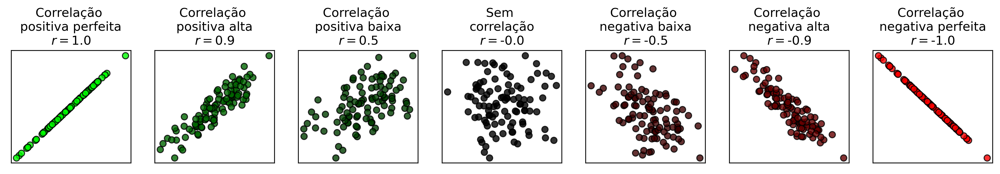
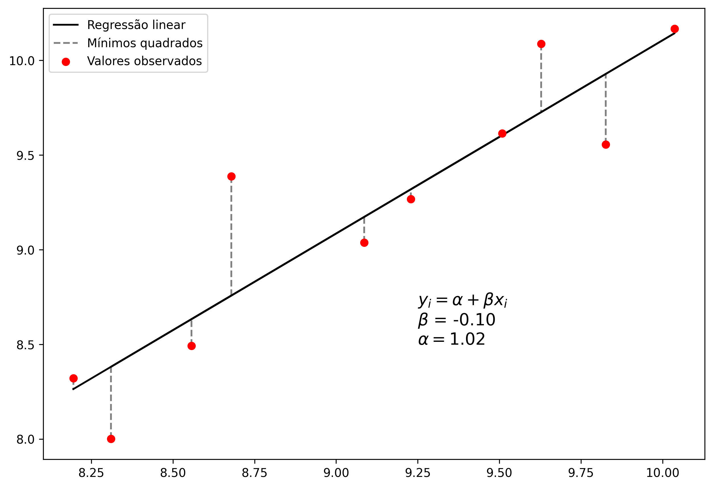
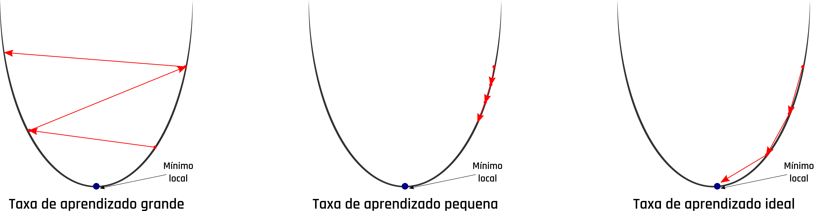

```{r, ech=FALSE}
library(reticulate)
use_python("/home/adriano/anaconda3/bin/python")
```
---
output: bookdown::html_document2
bibliography: bibfile.bib
fig_caption: yes
header-includes:
- \usepackage{float}
- \floatsetup[table]{capposition=bot}
---

# Regressão
Todas as pessoas pelo menos uma vez na vida já sentiu ou sentirá a necessidade 
de prever algum acontecimento futuro. Estamos a todo momento assimilando 
informações para realizar alguma tomada de decisão, seja de forma intrínseca ou 
não. No contexto de Machine Learning (ML) isso é feito pela técnicas de 
regressão. A regressão é uma ferramenta que busca modelar relações entre 
variáveis dependentes e independentes através de métodos estatísticos 
[@soto2013regression]. 

Uma variável independente, normalmente representada pela  variável $x$, 
caracteriza uma grandeza que está sendo manipulada durante um experimento e que 
não sofre influência de outras variáveis. Já a variável dependente, normalmente 
representada pela variável $y$, caracteriza valores que estão diretamente 
associados à variável independente, ou seja, ao ser manipulada os valores 
variável independente, o valor das variáveis dependentes também sofrem 
alterações. Na Figura \@ref(fig:happinessWorld) é apresentada a relação entre a 
expectativa de vida baseada e um índice de felicidade calculado em diversos 
países obtidos a partir de um levantamento feito por @helliwell2020social. A 
variável independente nesse exemplo é representada pelo índice de felicidade e a 
expectativa de vida age como variável independente, dessa forma pode ser 
observada uma tendência de expectativa de vida maior em países com alto índice 
de felicidade, com uma força de correlação de 0,77. 

```{r happinessWorld, echo=FALSE, fig.align="center", fig.cap='Relação entre o índice de felicidade e expectativa de vida. Fonte: [@helliwell2020social]'}
  knitr::include_graphics("assets/happiness_world.png")
```

As relações entre as variáveis dependentes e independetes são feitas através de 
algum coeficiente de correlação. Uma das métricas de correlação mais utilizadas 
é o coeficiente de Pearson, que mede a associação linear entre duas variáveis 
[@kirck2008pearson]. Os valores do coeficiente de Pearson variam entre -1 e 1, 
de tal forma que quanto mais próximos desses extremos, melhor correlacionado 
estão as variáveis. A Figura \@ref(fig:scatterCorrelations) mostra alguns 
exemplos com gráficos de disperssão de variáveis com diferentes correlações.

```{r scatterCorrelations, echo=FALSE, fig.align="center", fig.cap='Diferentes correlações entre variáveis. Fonte: [@helliwell2020social]'}
  
```

Os métodos de regressão se utilizam dessas correlações entre as variáveis para 
estimar valores não existentes na amostra ou conjunto de dados. Entretanto, nem
sempre essas correlações são tão explicítas assim, sendo necessário outras 
abordagens mais robustas para realizar as previsões.Em ML os modelos de 
regressão podem ser criados a partir de diversas abordagens, desde as mais 
simples com poucas configurações de parâmetros e de fácil interpretação do 
funcionamento, até as abordagens mais complexas. Os métodos de regressão 
abordados neste capítulo serão `Regressão linear`, 
`Máquina de vetores de suporte` e `Árvores de decisão`.

## Regressão Linear

A regressão linear é um dos métodos mais intuitivos e utilizados para essa 
finalidade. Esses métodos são dividos em dois grupos, a regressão linear simples
(RLS) e regressão linear múltipla (RLM). A RLS tem como objetivo estabelecer uma
relação entre duas variáveis através de uma função, que pode ser definida por:

\begin{equation} 
    y_{i} = \alpha+\beta x_{i}
(\#eq:rls-function)
\end{equation} 

Onde $y_{i}$ é a variável alvo, $\alpha$ e $beta x_{i}$ são coeficientes 
calculados pela regressão, que representam o intercepto no eixo $y$ e inclinação 
da reta, respectivamente.

A RLM é semelhante semelhante à RLS, porém possui multiplas variáveis 
preditoras, e pode ser definida por:

\begin{equation} 
    y_{i} = \alpha+\beta x_{i1}+\beta x_{i2}+...+\beta x_{in}
(\#eq:rlm-function)
\end{equation} 

Onde $y_{i}$ é a variável alvo, $\alpha$ continua sendo o coeficiente de 
intercepto e $\beta x_{ip}$ o é coeficiente angular da $p$-ésima variável. Ambos 
os métodos podem ainda serem somados a um termo $\epsilon$ de erro. 

### Coeficientes da regressão linear

Existem diversas abordagens para se calcular os coeficientes $\alpha$ e $\beta$ 
da equação da regressão linear, as técnicas baseadas em mínimos quadrados 
oridinários e gradiente descendente são as mais comuns. A seguir serão 
apresentados os funcionamentos dessas abordagens.

#### Métodos dos quadrados ordinários

O Método dos quadrados ordinários (MQO) ou método dos mínimos quadrados (MMQ),
busca encontrar o melhor valor para os coeficientes citados anteriormente, de 
tal forma que a diferença absoluta entre o valor real e o predito pela função 
seja a menor possível entre todos os pontos. A Figura \@ref(fig:ols) mostra um 
exmplo de regressão linar utilizando o MQO para o conjunto pontos descritos na
tabela a seguir:

|	Variável independente	|	Variável dependente	|
|	0.44	|	5.52	|
|	1.74	|	8.89	|
|	0.41	|	4.05	|
|	1.84	|	9.31	|
|	0.98	|	6.57	|
|	1.22	|	8.27	|
|	1.53	|	6.93	|
|	1.04	|	6.41	|
|	0.59	|	6.93	|
|	0.38	|	6.98	|

```{r ols, echo=FALSE, fig.align="center", fig.cap='Exemplo do método dos quadrados ordinários.'}
  
```

Para se chegar no resultado apresentado na Figura \@ref(fig:ols), os 
coeficientes da regressão linear foram ajustados, de tal tal forma que o erro 
quadrático médio entre entre a função e cada um dos pontos fossem a menor 
possível. A Figura \@ref(fig:ols-steps) mostra o ajuste dos coeficientes da 
equação em relação a cada ponto.

```{r ols-steps, echo=FALSE, fig.align="center", fig.cap='Ajuste da regressão linear por método dos quadrados ordinários.'}
  knitr::include_graphics("assets/ols-steps.png")
```

#### Gradiente descendente
O método do gradiente descendente (GD) é uma das técnicas mais utilizadas para 
otimização de modelos de ML. Este é um método interativo que busca encontrar os 
coeficiente $\alpha$ e $\beta$ através da minimização de uma função de custo, 
que normalmente é o erro quadrático médio (MSE - sigla do inglês, 
*mean squared error*).

O GD funciona de forma iterativa e inicializa os coeficientes com um valor 
predefinido ou aleatório. Em cada iteração é obtido o somatório do erro entre 
todos os valores das variáveis dependentes e valores calculados pela função. Com
base nesse erro e em uma taxa de aprendizagem do modelo predefinida, os valores
dos coeficientes da função são atualizados para a próxima iteração. A taxa de 
aprendizagem deve ser definda com um valor equilibrado. A definição de um valor 
muito alto para a taxa de aprendizagem pode levar o modelo a cair em um mínimo 
local, ou seja, o modelo não consegue chegar em seu melhor ajuste. Já quando a 
taxa de aprendizagem é definida com um valor muito baixo, o modelo demora mais 
tempo para chegar no ajuste ideal, necessitando de muito mais tempo e 
processamento até que haja a convergência. A Figura \@ref(fig:learning-rate) 
mostra o comportamento do GD com diferentes categorias de valores mencionadas 
para a taxa de aprendizagem.

```{r learning-rate, echo=FALSE, fig.align="center", fig.cap='Problemas na taxa de aprendizado do gradiente descendente.'}
  
```

Os prinicipais parâmetros a serem definidos nessa abordagem são a taxa de 
aprendizagem e o número de iterações. Considerando os pontos utilizados no 
exemplo anterior, foi aplicada a regressão linear utilizando o GD como método de 
atualização dos coeficientes. A Figura \@ref(fig:gd-example1) mostra o ajuste da 
função, custo e os coeficientes $\alpha$ e $\beta$ ao longo de 50 iterações com 
taxa de aprendizado muito baixa. Nessa figura pode ser observado que as 
iterações finalizam antes da convergência do modelo. 

```{r gd-example1, echo=FALSE, fig.align="center", fig.cap='Regressão linear com taxa de aprendizagem baixa no gradiente descendente.'}
  knitr::include_graphics("assets/gradient-descendent-small.png")
```

Como mencionado anteriormente, uma taxa de aprendizagem muito grande também 
interfere no ajuste dos coeficientes, uma vez o modelo não consegue atingir o 
mínimo global. A Figura \@ref(fig:gd-example2) mostra o resultado da execução da
regressão linear utilizando uma taxa de aprendizagem muito grande no GD.

```{r gd-example2, echo=FALSE, fig.align="center", fig.cap='Regressão linear com taxa de aprendizagem baixa no gradiente descendente.'}
  knitr::include_graphics("assets/gradient-descendent-large.png")
```

Já com uma taxa de aprendizagem equilibrada, o GD é capaz de ajustar os 
coeficientes de forma mais eficiente. A Figura  \@ref(fig:gd-example3) mostra
o resultado do algoritmo executado com uma taxa de aprendizagem mais 
equilibrada. Como os valores iniciais dos coeficientes são definidos de forma 
aleatória, nas primeiras iterações o gradiente apresenta uma alta pertubação, 
que vai se atenuando ao longo das épocas.

```{r gd-example3, echo=FALSE, fig.align="center", fig.cap='Regressão linear com taxa de aprendizagem baixa no gradiente descendente.'}
  knitr::include_graphics("assets/gradient-descendent.png")
```

Para dados com poucas dimensões, ou seja, poucas variáveis preditoras, o MQO é 
mais recomendado, pois diferente do GD, não é um algoritmo interativo, e sua
complexidade está associada diretamente à quantidade de pontos. Já o GD tem 
melhor performance quando os dados possuem muitas dimensões.

A regressão linear pode ser aplicada em uma vasta variedade de problemas, mas 
como foi apresentado ao longo desta seção, é necessário que os dados possuam uma 
alta correlação. Este algoritmo está disponível na biblioteca [Scikit-learn](https://scikit-learn.org/stable/modules/generated/sklearn.linear_model.LinearRegression.html) 
par ser utilizado em Python. Um exemplo utilizando a regressão linear é 
apresentado no código a seguir:

```{python}
from sklearn.linear_model import LinearRegression
import matplotlib.pyplot as plt


# Definição dos valores de uma única variável preditora
x = [[0], [1], [2], [3]] 

# Definição dos valores das variáveis alvo
y = [1.3, 2.2, 2.6, 3.3] 

# Instanciando regressão linear e ajustando-a aos dados
lr = LinearRegression().fit(x, y) 

# Obtendo os valores aproximados da variável alvo
y_regression = [lr.predict([xi])[0] for xi in x] 

# Criando novos pontos somente com valores da variável preditora
x_test = [[-1], [2.75], [4.3]]

# Aplicando regressão linear para prever os valores da variável alvo
y_test = lr.predict(x_test)

# Concatenando dados de treino e teste
y_regression = [*y_regression, *y_test]
x_regression = [*x, *x_test]

# Exibindo dados de treino
plt.scatter(x, y, color='gray', label='Dados de treino') 

# Exibindo dados de teste
plt.scatter(x_test, y_test, color='red', label='Dados de teste')

# Exibindo reta da regressão linear
plt.plot(x_regression, y_regression, color='black', label='Regressão linear')

#Configurações do gráfico
plt.xlabel('Variável preditora ($x$)')
plt.ylabel('Variável alvo ($y$)')
plt.legend()
plt.show()
```


 


