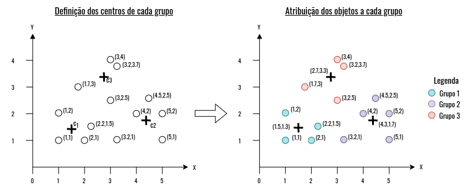
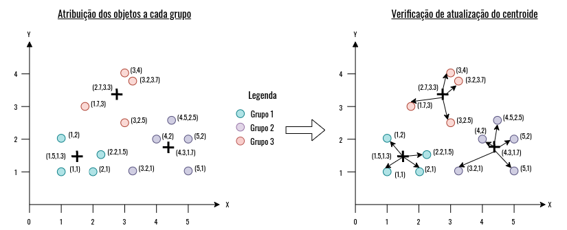
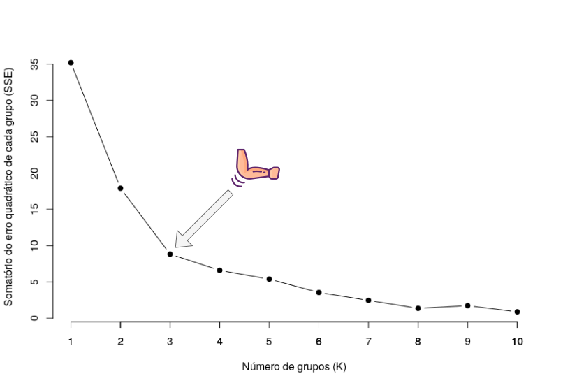

<!-- TODO: usar imagem desse livro na apresentação https://mhweber.github.io/AWRA_2020_R_Spatial/ -->

<!-- TODO: pensando em add a citação de que o termo cluster apareceu em um artigo 
em 1959 -->


# Agrupamento

> Afinal, todos nós nos enquadramos em um grupo. - (autor desconhecido) 

Vimos até agora que os métodos de classificação e regressão usam conjuntos de
dados rotulados e usamos tais métodos para encontrarmos modelos que descrevam
nossos dados. Em resumo, os métodos de classificação realizam a predição de dados categóricos, de modo oposto, os métodos de regressão fazem a predição de dados contínuos, sendo que ambos precisam dos rótulos para criarem seus modelos.

As técnicas de agrupamento operam de modo diferente do que foi visto até então, 
pois usam conjunto de dados não rotulados, o que modifica à forma com que os 
métodos aprendem e é isso que vamos ver neste capítulo!

Neste capítulo, vamos aprender o que é um agrupamento e suas técnicas, com exemplos práticos usando as linguagens de programação `R` 
e `Python` na plataforma Kaggle. Vamos começar respondendo à pergunta: 

> "O que é um agrupamento?"

## O que é um agrupamento?

Para entendermos o conceito de agrupamento, vamos começar com um exemplo prático. 
Digamos que você tenha um amigo que adora livros, e ele tem muitos deles, mas 
tem muitas dificuldades em organizá-los. Então, você, uma pessoa muito 
disposta, sugere ao seu amigo algumas formas de como organizar esses livros, 
por exemplo: **separá-los** por gênero, cores ou ordem alfabética. Aderindo às 
suas dicas, seu amigo decidiu agrupá-los por gênero, assim, com essa nova 
organização foi possível encontrar diversos **grupos** de livros separados por 
gênero, como apresentado na Figura \@ref(fig:clustering-book).

```{r clustering-book, echo=FALSE, fig.align="center", fig.show = "hold", fig.cap='Antes e depois da organização da prateleira de livros por grupos baseados em gênero.'}
# refazer essa figura
knitr::include_graphics("./assets/clustering.png") 
```

> Utilizamos cores para dividir os gêneros na Figura \@ref(fig:clustering-book) 
apenas para facilitar a vida do design.

A partir do exemplo acima, vimos que os **grupos** foram criados de acordo 
com uma característica, neste caso, gênero, mas poderíamos ter **grupos** de 
livros com mais de uma característica. Por exemplo, grupos com livros do mesmo 
gênero e o mesmo ano de lançamento, ou do mesmo gênero e com a mesma cor, e 
assim por diante. Assim, podemos concluir que livros pertencentes ao mesmo grupo
são semelhantes entre si, ou seja, possuem características iguais ou parecidas,
mas são diferentes se comparados com livros de outros grupos. Com isso, 
aprendemos um conceito fundamental em agrupamento, que é a definição de um 
grupo.


Em aprendizado de máquina, o ato de separar objetos em **grupos** (em inglês, 
*clusters*) por meio de determinadas características de um conjunto de dados é 
conhecido como **agrupamento** (em inglês, *clustering*), e a maneira com que esses grupos
são formados é chamado de **técnicas** ou **métodos** de **agrupamento**. De 
modo oposto do que vimos nos capítulos anteriores, as técnicas de agrupamento possuem o aprendizado não supervisionado, ou seja, usam conjuntos de dados não rotulados para criarem seus modelos. 

Diante da vasta quantidade de dados gerados diariamente, provindos de diferentes
fontes, como radares, redes sociais e *smartphones*, torna-se cada 
vez mais difícil obter conjuntos de dados rotulados, pois, por vezes, é 
necessária a presença de um especialista para criar ou gerenciar esses rótulos. 
Desta forma, o uso de técnicas de agrupamento pode auxiliar no processo de 
descoberta de conhecimento e criação dos rótulos a partir dos grupos gerados. 

Técnicas de agrupamento caem como luva na mão de cientistas e analista de dados, 
uma vez que identificam padrões em conjuntos de dados através da organização dos
dados em grupos. Em detalhes, os grupos são formados por objetos que possuem a 
máxima semelhança entre si, e a mínima semelhança com elementos de outros grupos 
[@aghabozorgi2015time] - como vimos no exemplo dos livros. Para identificar esse
grau de semelhança entre os objetos precisamos de uma 
**medida de similaridade**, pois é ela que vai nos dizer o quão parecidos ou não
são os objetos que desejamos agrupar. Para isto, medidas de distância são usadas
para determinar tal similaridade, por exemplo, a distância euclidiana entre os 
pontos de dois objetos.

> Explicamos a diferença entre cientista e analista de dados no nosso minicurso 
de [Introdução à análise de dados](https://dataat.github.io/introducao-analise-de-dados/introdu%C3%A7%C3%A3o.html#o-que-%C3%A9-an%C3%A1lise-de-dados).

Na Figura \@ref(fig:agrup-exemplo) vemos dois exemplos de agrupamentos em um espaço com duas dimensões ($X$ e $Y$). O primeiro agrupamento 
\@ref(fig:agrup-exemplo)(a) possui 3 grupos e o segundo 8 
\@ref(fig:agrup-exemplo)(b). Note que o termo objeto refere-se a uma linha
do conjunto de dados, conforme ilustrado, em que um objeto no 
**Grupo 8** possui os valores de $X = 8$ e $Y = 8$.

```{r agrup-exemplo, echo=FALSE, fig.align="center", fig.show = "hold", out.width = "50%", fig.cap='Exemplo de dois agrupamentos em um plano com duas dimensões (X,Y). Observam-se 3 grupos em a) e 8 grupos em b). Adaptado de @esling2012time '}
# refazer essa figura
knitr::include_graphics(c("./assets/clust_1_ex.png", "./assets/clust_2_ex.png")) 
```

De acordo com @jain2010data, um dos grandes estudiosos da área de 
*machine learning*, o uso de técnicas agrupamento podem ser divididos em três principais aplicações:

- **Descoberta de conhecimento em estruturas intrínsecas**: para obter 
informações sobre dados, gerar hipóteses, detectar anomalías e identificar 
características salientes.
- **Classificação natural**: por exemplo, na Biologia, para identificar o grau 
de semelhança entre formas ou organismos (relação filogenética).
- **Compressão**: como um método para organizar os dados e resumi-los através de
protótipos de agregados.

Além das aplicações mencionadas por @jain2010data, como descoberta de padrões, 
detecção de *outliers* e análise de distribuições intrínsecas nos dados; 
segundo @han2011data, às técnicas de agrupamento podem ser usadas em
etapas de pré-processamento para outros algoritmos, por exemplo, na 
caracterização, seleção de subconjuntos de atributos e classificação. Desta 
forma, diante dessas aplicações, o uso de técnicas de agrupamento encontra-se em 
diversas áreas do conhecimento, entre elas: Biologia: [@gasch2002exploring], 
Sensoriamento Remoto: [@he2014enhanced] e *business intelligence*: [@wang2005support].

Agora que entendemos o que é um agrupamento e suas aplicações, na próxima 
subseção vamos mostrar algumas técnicas de agrupamento e quais as principais diferenças entre elas.

```{r graph-types-datasets, echo=FALSE, fig.align="center", fig.cap='Exemplos', fig.height=4, fig.width=10, cache=TRUE}

  # set.seed(10)
  # x <- cbind(c(runif(20, min = -2, max = 2),
  #              runif(20, min = 6, max = 10),
  #              runif(20, min = 0, max = 6)))
  #
  # y <- cbind(c(runif(20, min = -2, max = 2),
  #              runif(20, min = -2, max = 2),
  #              runif(20, min = -10, max = -4)))
  #
  #
  # df <- data.frame(x,y)
  # plot(df$x, df$y)
  # df_clust <- pam(df, k = 3)
  # plot(df_clust)

  # classes <- c(rep("1", 20), rep("2", 20), rep("3", 20))
  # colors <- c("#00AFBB", "#E7B800", "#FC4E07")
  # colors <- colors[as.numeric(classes)]
  #
  # shapes = c(16, 17, 18)
  # shapes <- shapes[as.numeric(classes)]
  #
  # df <- data.frame(x, y, classes)
  #
  # par(mfrow = c(1,2))
  #
  # plot(df$x, df$y, type = "p", col = colors, pch = shapes,
  #      xlab = "", ylab = "", main = "(a) Supervisionado")
  #
  # legend("bottomright", legend = levels(df$classes),
  #     col =  c("#00AFBB", "#E7B800", "#FC4E07"),
  #     pch = c(16, 17, 18))
  #
  #  plot(df$x, df$y, type = "p",
  #      xlab = "", ylab = "", pch = 19, main = "(b) Não Supervisionado")
```

## Técnicas de agrupamento

Como vimos anteriormente, cada técnica de agrupamento possui uma abordagem para 
criar grupos em um conjunto de dados, por exemplo, algumas técnicas são baseadas
em pontos centrais de cada grupo (centróide); em outras os grupos são criados 
seguindo uma hierarquia presente nos dados. Neste minicurso, vamos mostrar três 
abordagens de técnicas de agrupamento: **baseadas em partição** e **hierarquia**. A seguir vamos comentar de maneira bem resumida cada uma.

### Técnicas baseadas em Partição

<!-- técnicas baseadas em partição-->
Nas técnicas **baseadas em partição**, cada grupo representa uma partição, e o 
número de grupos é definido pelo usuário. Desta forma, cada partição deve conter
pelo menos um objeto, e cada objeto deve pertencer somente a um grupo, o que 
é conhecido como **separação exclusiva de grupos** (em inglês, 
*exclusive cluster separation* ou *hard cluster*). Existem métodos que 
flexibilizam o critério de separação exclusiva, sendo assim, o objeto possui 
porcentagens de pertencimento a cada grupo, o que é conhecimento como técnicas 
de agrupamento nebulosas (em inglês, *fuzzy clustering*). A Figura 
\@ref(fig:centroid-based) mostra um exemplo de agrupamento baseado em partição, 
as linhas pretas demarcam cada partição.

```{r centroid-based, echo=FALSE, fig.align="center", fig.show = "hold", fig.cap='Exemplo de um agrupamento beaseado em partição. As linhas pretas demarcam as partições e as figuras preenchidas os centróides. Adaptado de @google2020'}
knitr::include_graphics("./assets/centroid_bases.png") 
```

Além das características mencionadas acima, grande parte das técnicas baseadas 
em partição usam medidas de distâncias para determinar o grau de similaridade de 
cada grupo. Outra característica importante de mencionar, é a representação de 
cada grupo, o centróide (Figura \@ref(fig:centroid-based), que pode ser definido
pela média ou qualquer outra medida estatística Um dos algoritmos mais 
utilizados baseados em partição é o *Kmeans* - vamos explicá-lo na subseção 
seguinte.

<!-- técnicas baseadas em hierarquia-->
### Técnicas baseadas em Hierarquia

As técnicas baseadas em hierarquia, diferente dos que vimos nas técnicas de 
partição, não é requerido que o especialista especifique o número de grupos, 
pois seu algoritmo busca por correlações entre os objetos do conjunto de dados 
para criar os grupos. Os métodos hierárquicos podem ser divididos em 
**aglomerativos** ou **divisivos**, baseado no modo em que sua decomposição hierárquica é formada. No método **aglomerativo**, também conhecidos como 
AGNES (*Agglomerative Nesting*), considera-se, inicialmente, que cada objeto seja seu próprio grupo, e a cada iteração, os dois grupos mais parecidos são juntados, desta forma, formando um novo um grupo, esse processo é repetido até que todos os objetos estejam em um único grupo. De modo oposto, o método **divisivo**, também conhecidos como DIANA (*Divise Analysis*), considera-se que todos objetos pertencem a um único grupo, e posteriormente, divide-se o único grupo até obter-se um grupo para cada objeto ou até que um critério de párada seja atendido [@han2011data].

```{r hierarquical-based, echo=FALSE, fig.align="center", fig.show = "hold", fig.cap='Exemplo do processo de criação de grupos baseado nas técnicas de agrupamento hierarquicas. - Fonte: @han2011data'}
knitr::include_graphics("./assets/metodo_hierarquico.png") 
```


Na Figura \@ref(fig:hierarquical-based) é possível observar o
processo de criação de grupos dos dois métodos mencionados, AGNES e DIANA, com
base em um conjunto de dados com cinco objetos $a, b, c, d, e$. Por exemplo,
no método aglomerativo, o objeto $a$ junta-se com o objeto $b$ no mesmo grupo,
pois possuem maior semelhança se comparados com outros objetos, o mesmo processo acontece com os objetos $d$ e $e$. Por outro lado, o método de divisão inicia
com todos os objetos pertencendo a um grupo, e a cada passo vai se dividindo com
base na semelhança dos objetos dentro do grupo.

Uma técnica que auxilia na interpretação dos agrupamentos hierárquicos é o dendrograma, apresentado na Figura \@ref(fig:dend-based), representando em forma de árvore, nele é possível obter informações sobre a estrutura do agrupamento realizado. No nível 0 é possível observar os objetos em seus próprios grupos, e, conforme o nível da árvore aumenta em relação a sua raiz, menor são as similaridades entre os objetos do mesmo grupo [@han2011data]. 

```{r dend-based, echo=FALSE, fig.align="center", fig.show = "hold", fig.cap='Exemplo de representação do agrupamento hierarquico. - Fonte: @han2011data'}
knitr::include_graphics("./assets/den_eg_1.png") 
```

> Neste minicurso, vamos abordar o método aglomerativo, no entanto, os mesmos 
conceitos podem ser aplicados no método divisivo.


## Kmeans

Kmeans ou K-médias é uma técnica de agrupamento que usa o método de partição
para dividir o conjunto de dados em $k$ grupos, em que o valor de $k$ é definido
pelo usuário - posteriormente vamos apresentar algumas heurísticas que auxiliam na determinação do número de grupos. De forma geral, o algoritmo do Kmeans visa
diminuir a variação intra-grupos, ou seja, criar grupos em que os objetos sejam
semelhantes entre si. Então, para que esse objetivo seja atendido, a cada
iteração os centros de cada grupo são atualizados para refinar a qualidade dos
grupos.

Para exemplificar o funcionamento do Kmeans, vamos usar o conjunto de dados
apresentado na Figura \@ref(fig:kmeans-dataset), no qual é possível observar 13
objetos em um plano cartesiano (X,Y).


```{r kmeans-dataset, echo=FALSE ,fig.align="center", fig.cap='Conjunto de dados utilizado como exemplo.'}
  knitr::include_graphics("assets/kmeans_conjunto_de_dados.png")
```

Para separar as observações de forma a obter grupos mais homogêneos,
a técnica em questão usa o conceito de centróide, em que é definido
um ponto central para cada grupo com base em medidas estatísticas, como a
média, e a cada iteração o ponto central é atualizado até que o critério de
párada seja alcançado. Então, o primeiro passo do algoritmo é a escolha da
quantidade de grupos, neste exemplo, escolhemos três grupos. Com isso, a próxima
etapa consiste em sortear, de forma aleatória, o centróides de cada grupo, como
apresentado na Figura \@ref(fig:kmeans-algorithm). Após o sorteio, os objetos são atribuidos aos seus respectivos grupos, como também apresentado na Figura
\@ref(fig:kmeans-algorithm). A atribuição é feita com base em uma medida de
distância, geralmente, euclidiana; cada objeto é comparado com cada
centróide, assim, o objeto é atribuído ao grupo em que possui a menor distância
com seu centróide.


```{r kmeans-algorithm, echo=FALSE ,fig.align="center", fig.cap='Exemplo de funcionamento do algoritmo Kmeans.'}
  
```

Na Figura \@ref(fig:kmeans-algorithm) observamos três centróides $c_1$,
$c_2$ e $c_3$, nas posições: $(1.5,1.3)$, $(4.3,1.7)$ e $(2.7,3.3)$,
respectivamente. Para sabermos em qual grupo o objeto será atribuído basta usar
uma medida de distância e verificar qual centróide está mais próximo deste
objeto. Por exemplo, seja o objeto que está na posição $(3.2,1)$, temos:


$$
x_{obj} = 3.2\\
y_{obj} = 1.0\\ 
\\
x_{c1} = 1.5\\
y_{c1} = 1.3\\ 
\\
x_{c2} = 4.3\\
y_{c2} = 1.7\\ 
\\
x_{c3} = 2.7\\
y_{c3} = 3.3\\ 
\\
dist_{c1} = \sqrt{(x_{obj} - x_{c1})^2 + (y_{obj} - y_{c1})^2} \approx 1.73 \\
dist_{c2} = \sqrt{(x_{obj} - x_{c2})^2 + (y_{obj} - y_{c2})^2} \approx 1.30 \\
dist_{c3} = \sqrt{(x_{obj} - x_{c3})^2 + (y_{obj} - y_{c3})^2} \approx 2.35\\
$$
Desta forma, a menor distância ($dist$) é dada pelo centróide $c_2$, então o
objeto é atribuído ao grupo deste centróide. Após a atribuição, o centróide é
recalculado com base nos objetos do grupo (Figura \@ref(fig:kmeans-algorithm-2)),
como foi dito anteriormente, podemos usar medidas estatísticas, como a média para
achar a nova posição do centróide. Caso, não haja alterações nos valores dos
centróides, o algoritmo pára. Caso não, o processo se repete: atualização dos
centróides e atribuição dos objetos a cada grupo.

```{r kmeans-algorithm-2, echo=FALSE ,fig.align="center", fig.cap='Exemplo de funcionamento do algoritmo Kmeans.'}
  
```

Resumidamente, podemos descrever o algoritmo do Kmeans conforme as etapas abaixo:

- (1º Passo) Definição da quantidade de grupos;
- (2º Passo) Sorteio de centróides para cada grupo;
- (3º Passo) Atribuição dos objetos a cada grupo;
- (4º Passo) Atualização dos centróides de cada grupo;
- (5º Passo) Caso os centróides sejam atualizados, volte ao passo (3), caso não,
o algoritmo pára.


> Lembrando que, outro critério de párada é o número de iterações, pois nem
sempre é possível convergir para o ótimo local com poucas iterações. Ainda mais
com conjuntos de dados de aplicações reais. Outro fato a mencionar, é o sorteio de centróides, pois existem diversas métricas que podem ser utilizadas em relação a inicialização dos centróides, por exemplo, k-means++.


Agora que entendemos mais de perto como o kmeans funciona. Talvez, você esteja 
se perguntando,mas, como verificamos a eficiência do nosso agrupamento? Isso é o que vamos responder na próxima subseção. Também vamos comentar como podemos 
estimar o número de grupos em um conjunto de dados.


### Como avaliar o Kmeans?

Como mencionado anteriormente, o objetivo do kmeans é minimizar a variação
intra-grupos, vimos que isso é feito com base na atualização dos centróides em cada iteração
do algoritmo, até que não haja mudança na atualização dos centróides. Então,
para verificarmos o erro de cada grupo, podemos usar a soma das diferenças
quadráticas (do ingles, *sum of squared error*) entre cada objeto e o centróide do seu grupo. Por exemplo, na Figura \@ref(fig:kmeans-algorithm-2) para calcularmos o
erro quadrático do **Grupo 1**, temos a seguinte equação:


$$
SSE(grupo_{1}) = \sum_{x_i \in grupo_{1}} dist(x_i - c_1)^2
$$
Em que $x_i$ representa cada objeto do grupo, $c_1$ representa o centróide do
grupo 1 e $dist$ a medida de distância utilizada. Logo, o $SSE(grupo_1) \approx 1.9$, em outras palavras, o erro quadrático do grupo 1 é a distância de todos os
objetos em relação seu centróide. Então, para calcularmos o erro total dos grupos,
basta fazermos um somatório de cada SSE:


$$
SSE_{total} = SSE(grupo_1) + SSE(grupo_2) + SSE(grupo_3)
$$
Então, para este agrupamento apresentado no exemplo acima, temos o 
$SSE_{total} \approx x$, em outras palavras, o erro total do nosso agrupamento, 
é representado pela soma dos erros quadráticos de cada grupo. 

Agora que vimos como calcular o erro do nosso agrupamento, só nos resta uma 
forma de "descobrir" qual a quantidade ideal de grupos para cada agrupamento e 
é que vamos ver na próxima subseção.


### Como definir a quantidade de grupos?

Nesta subseção vamos mostrar dois métodos para definir a quantidade de grupos, 
sendo eles: **Método do Cotovelo** e **Método da Silhueta**.

> É recomendado perguntar ao especialista sobre a quantidade de grupos, no caso 
da ausencia de um, podemos optar pelo uso de heurísticas. Duas deles são apresentadas abaixo.


#### Método do cotovelo

O método do cotovelo (do inglês, *elbow*) usa o somatório do erro total dos 
grupos em cada agrupamento para determinar o número, como apresentado na Figura \@ref(fig:kmeans-elbow). Então, a ideia deste método é gerar diversos agrupamentos 
com diferentes números de grupos, com o incremento do número de grupos, o erro total tende a diminuir, até que o erro se aproxime de zero, que é quando terá um
objeto por grupo.


```{r kmeans-elbow, echo=FALSE ,fig.align="center", fig.cap='Método do cotovelo aplicado no conjunto de dados de exemplo.'}
  
```

De acordo com o método, o número ideal de grupos se dá quando o ponto forma uma 
curva semelhante de um cotovelo, que é o ponto considerado ideal. Pois os pontos 
acima do cotovelo estão em uma região em que  *underfitting* e abaixo dele em *overfitting*.


#### Método de Silhueta

O método de Silhueta determina o quão bem cada objeto está alocado em um grupo, ou seja, a homogeneidade de um grupo. O índice de Silhueta varia de -1 a 1. Valores próximos a 1 indicam que o objeto possui semelhança com objetos de seu grupo e dessemelhança com objetos de outros grupos.  

```{r kmeans-silhueta, echo=FALSE ,fig.align="center", fig.cap='Método de Silhueta aplicado no conjunto de dados de exemplo.'}
  knitr::include_graphics("assets/indice_silhueta.png")
```


A Figura \@ref(fig:kmeans-silhueta) mostra um exemplo de aplicação do método de Silhueta, o número ideal de grupos é escolhido com base na média do maior do índice de Silhueta, ou seja, com 3 grupos foi possível obter grupos com objetos semelhantes entre si, e dissemelhante se comparados com objetos de outros grupos.

Agora que entendemos os fundamentos da técnica de agrupamento **Kmeans** e 
algumas técnicas de estimativas de grupos, vamos apresentar alguns exemplos práticos na plataforma kaggle, os exemplos estão disponíveis nas linguagens R e Python.

<!-- ### Exemplos -->

<!-- > Link para o kaggle -->

## Agrupamento Hierarquico - Método Aglomerativo

Os métodos de agrupamento hierárquicos que pertencem à categoria de
aglomerativos baseia na junção de grupos até que apenas um grupo englobe
todos os outros, esse chamado de raiz. Os objetos no método aglomerativo são comparadas com base em uma medida de distância, como vimos no **Kmeans**, em que foi usado a distância euclidiana. No entanto, neste método, os grupos também são comparados, para que a união entre eles também seja realizada. Para compararmos a similaridade entre cada grupo usamos as medidas de ligação (do inglês, *linkage measures*). As medidas de ligação mais conhecidos são:

- **Ligação completa ou distância máxima**: Em inglês, *complete linkage*,
determina como medida de similaridade os pares mais distantes entre dois
grupos.


$$dist_{max}(g_1, g_2) = \underset{obj_{g_1} \in g_1,obj_{g_2} \in g_2}{\max \{|obj_1 - obj_2|\}}$$ 

Em que $g_1$ e $g_2$ correspondem aos grupos 1 e 2, respectivamente. 

- **Ligação única ou distância mínima**: Em inglês, *single linkage*, determina como medida de similaridade os para mais próximo entre dois grupos.
$$dist_{min}(g_1, g_2) = \underset{obj_{g_1} \in g_1,obj_{g_2} \in g_2}{\min \{|obj_1 - obj_2|\}}$$

- **Distância baseada em média**: Em inglês, *average method*, determina a 
distância entre cada grupo com base na média de todos os pares de objetos. 

$$dist_{avg} = \frac{1}{|g_1||g_2|} \sum_{i = 1}^{g_1}\sum_{j=1}^{g_2}dist(obj_i, obj_j)$$

Para exemplificar o funcionamento do método aglomerativo, vamos 
usar o conjunto de dados apresentado na Figura \@ref(fig:hierarquico-dataset), 
no qual é possível observar 6 objetos (A,B,C,E,F) em um plano cartesiano (X,Y).

> Os objetos foram marcados para facilitar a visualização do dendograma.

```{r hierarquico-dataset, echo=FALSE ,fig.align="center", fig.cap='Conjunto de dados utilizado como exemplo.'}
  knitr::include_graphics("assets/dataset_hierarquico.png")
```


Como foi mencionado, os métodos aglomerativos iniciam de forma em que cada objeto 
seja seu próprio grupo, e com isso, a cada iteração os grupos vão se juntando e 
combinando os objetos dentro deles. O primeiro passo do algoritmos hierárquicos, abrangendo às duas categorias, divisivos e aglomerativo, é calcular a matriz de distância entre todos os objetos. A Figura \@ref(fig:hierarquico-alg-0) mostra um exemplo do cálculo da distância do objeto **A** entre os outros.

```{r hierarquico-alg-0, echo=FALSE ,fig.align="center", fig.cap='Conjunto de dados utilizado como exemplo.'}
  knitr::include_graphics("assets/dendograma_0.png")
```

> Vamos deixar como tarefa para que você calcule a distância euclidiana entre os outros objetos.

Então, seguindo com o algoritmo, o próximo passo consiste na junção dos objetos em grupos, como foi dito, cada objeto inicialmente pertence ao seu próprio grupo. A etapa de junção dos objetos aos grupos segue a mesma ideia do que vimos no Kmeans, só que aqui estamos comparando dois objetos, e não os objetos com seus centróides. Então, os objetos mais próximos se juntam em um grupo, como apresentado na Figura \@ref(fig:hierarquico-alg-1). A junção
segue uma ordem, os objetos com as menores distâncias se juntam primeiro, então,
neste exemplo, primeiro vamos juntar os objetos **E** e **F** que estão em 1
unidade de distância, depois juntamos os objetos **A** e **B**, como mostrado na
Figura \@ref(fig:hierarquico-alg-0), que possuem a distância de $1.41$, e, por fim,
juntamos os objetos **D** e **C** que possuem a distância de $1.5$. Utilizando o
Dendrograma é possível observar essas distância no eixo de **Altura**.


```{r hierarquico-alg-1, echo=FALSE ,fig.align="center", fig.cap='Etapa de junção dos objetos.'}
  knitr::include_graphics("assets/dendograma_1.png")
```


Depois de juntarmos todos os pares de objetos em um grupo, que até então estavam em seus próprios grupos, é hora de juntarmos os grupos. Nesta etapa de junção dos grupos, vamos utilizar as abordagens de ligação que foram mencionadas acima. A 
Figura \@ref(fig:hierarquico-alg-2) apresenta o funcionamento dos métodos de 
ligação mencionados, em **A)** temos a ligação completa, que visa juntar os dois grupos mais próximos pelos objetos mais distantes; em **B)** temos a ligação 
única, que faz a junção de modo oposto do que vimos em **A)**, usando os objetos mais próximos de cada grupo, e em **C)**, temos a ligação pela média, que visa realizar a junção por meio da média das distâncias entre cada objeto dos dois grupos. 

```{r hierarquico-alg-2, echo=FALSE ,fig.align="center", fig.cap='Etapa de junção dos grupos.'}
  knitr::include_graphics("assets/dendograma_2.png")
```


Por fim, a Figura \@ref(fig:hierarquico-alg-3) apresenta o resultado final do agrupamento aglomerativo por meio do método de ligação completa, veja que ao 
final apenas um grupo engloba todo os objetos. Na junção do grupo que engloba os objetos **A**, **B**, **C** e **D** com o grupo dos objetos **E** e **F**, a distância máxima (4.16) se dá pelos objetos **A** e **F**. 

> Vamos deixar como tarefa para que você monte os dendrogramas dos métodos de
ligação única e por média. Lembrando que o dendrograma mostra a distância entre os grupos por meio do eixo de altura. Desta forma, o dendrograma varia com o método de ligação. Por exemplo, o dendrograma do método de ligação única é mais achatado, visto que a maior altura corresponde a 2.06.


```{r hierarquico-alg-3, echo=FALSE ,fig.align="center", fig.cap='Etapa de junção dos grupos - Parte 2.'}
  knitr::include_graphics("assets/dendograma_3.png")
```

Resumidamente, podemos descrever o algoritmo do método aglomerativo conforme as etapas abaixo:

- (1º Passo) Crie a matriz de distância entre os objetos;
- (2º Passo) Faça com que cada objeto seja um grupo;
- (3º Passo) Junte os grupos mais próximos;
- (4º Passo) Atualize a matriz de distância;
- (5º Passo) Repita o passo 3 e 4 até que apenas um grupo englobe todos os 
objetos.

Agora que entendemos como funciona o método aglomerativo, você deve estar se 
perguntando: "Qual método de ligação devo usar?" e é isso é o que vamos ver agora.


### Qual método de ligação deve ser usado?

Assim como a escolha do número de grupos no *Kmeans*, a escolha do método de ligação também é essencial, no entanto, cabe ao usuário testar os diversos métodos de ligação para determinar qual se adequa melhor ao seu caso. Vamos listar algumas vantagens e desvantagens dos métodos menionados acima retirados do material dos professores @jin2012.

| Método                     | Vantagens                                    | Desvantagens                                                                         |   |   |
|----------------------------|----------------------------------------------|--------------------------------------------------------------------------------------|---|---|
| Ligação  única             | Consegue lidar com  formas não elípticas     | Sensível a ruídos e outliers                                                         |   |   |
| Ligação  Completa         | Consegue lidar melhor  com ruídos e outliers | Tende a quebrar grandes grupos; Possui viés para agrupamentos com  dados circulares. |   |   |
| Distância baseada em média | Consegue lidar melhor  com ruídos e outliers | Possui viés para agrupamentos com  dados circulares.                                  |   |   |
  

> Além dos métodos de ligação mencionados acima, existem outros que são igualmentes importantes, como: Ward e Centróide

### Como definir a quantidade de grupos?

Como vimos, o dendrograma mostra a hierarquia do nosso agrupamento com o formato de árvores, aos que estão familiarizados com estrutura de dados, especificamente uma árvore binária. Assim, podemos fazer um corte nessa árvore e selecionar os grupos que desejamos de acordo com a altura especificada. Por exemplo, a Figura
\@ref(fig:hierarquico-cut) mostra a aplicação do método aglomerativo por meio de ligação completa no conjunto de dados utilizado no exemplo do Kmeans, os $K$ em cada dendrograma é o nível em que o corte foi realizado. Desta forma, cortando um nível abaixo da raiz, ou seja, $k = 2$, obteve-se dois grupos, com $k = 5$, obteve-se cinco grupos, e assim por diante. O corte no dendrograma nos dá uma visão dos grupos intrínsecos em cada nó da árvore, o que pode auxiliar no entendimento do conjunto de dados


```{r hierarquico-cut, echo=FALSE ,fig.align="center", fig.cap='Cortes nos dendrogramas para visualização dos grupos.'}
  knitr::include_graphics("assets/dendograma_cut.png")
```


Como mostrado acima, o $k$ define a quantidade de grupos que serão mostrados no dendrograma através de um corte feito numa árvore binária. E como foi visto no Kmeans utilizamos as heurísticas do cotovelo e silhueta para determinar o número de $k$, o que pode ser feito neste método também.

Você deve estar se perguntando: "Como faço para avaliar os grupos gerados no corte?". Para avaliarmos a qualidade dos grupos podemos usar o índice de Silhueta, que verifica o quão bem os objetos foram ajustados em um grupo e quão eles se diferenciam dos objetos de outros grupos.


Agora que entendemos os fundamentos da técnica de agrupamento aglomerativa e como podemos definir os grupos, vamos apresentar alguns exemplos práticos na plataforma kaggle, os exemplos estão disponíveis nas linguagens R e Python.


### Exemplos

## Saiba mais


