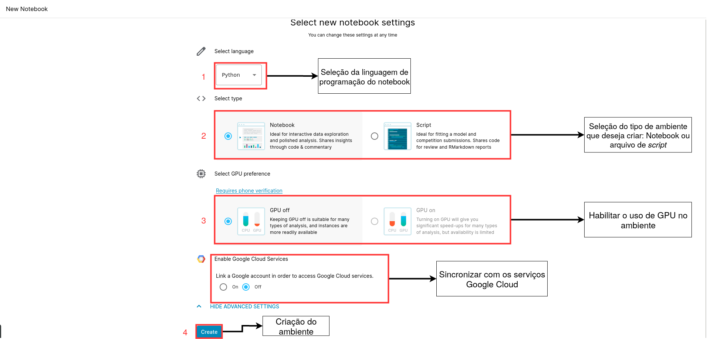
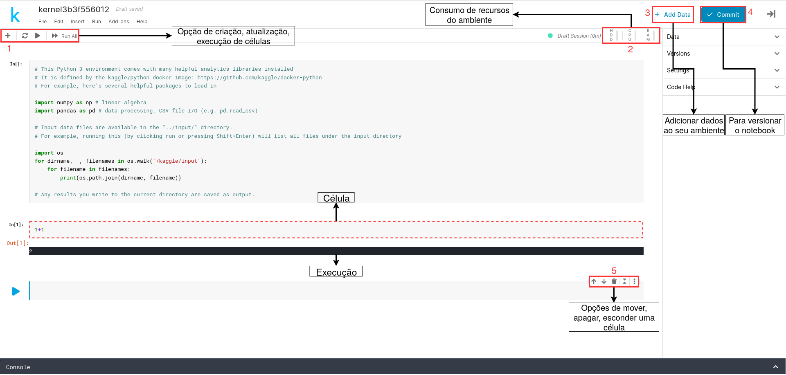

\cleardoublepage

# (PART) Apendice {-}

# Sobre o Kaggle

Criada em 2010, Kaggle é uma plataforma que possibilita a realização de uma ampla quantidade de atividades que envolvem as áreas de Data Science e Machine Learning. Com o uso da plataforma, o usuário tem acesso a um ambiente *web* gratuito para a execução de código nas linguagens [Python](https://www.python.org/) e [R](https://www.r-project.org/). Neste ambiente são disponibilizados diversos conjuntos de dados que podem ser fácilmente importados para os ambientes de análise. Além disso, o Kaggle é muito conhecido por ter uma grande comunidade de usuários ativos.

Outra característica que torna o Kaggle muito famoso são as competições, nessas, os usuários são desafiados a resolver problemas do mundo real. Normalmente empresas e instituições de ensino utilizam o Kaggle para criar tais competições e utilizar essas como um catalizador para a identificação de bons profissionais.

Dado este contexto inicial, neste documento, serão abordados os primeiros passos de uso da plataforma e os principais conceitos envolvidos em seu uso.

## Cadastro

Para iniciar o processo de cadastro, acesse o [Kaggle](https://www.kaggle.com/). Na página principal da plataforma, apresentada na Figura \@ref(fig:telacadastro), clique no ícone ${\textbf{Register}}^{\color{red}1 \ ou \ \color{red}3}$. Caso já tenha uma conta registrada, utilize a opção ${\textbf{Sign In}}^{\color{red}{2}}$.


```{r telacadastro, echo=FALSE, fig.align='center', fig.cap='Tela inicial'}
knitr::include_graphics("assets/appendix-kaggle/tela_inicial.png")
```


Após aceitar os termos de uso, é necessário inserir o código de segurança (Figura \@ref(fig:codigo)), o qual foi enviado no email cadastrado. Caso não tenha recebido, verifique a caixa de *Spam*.


```{r codigo, echo=FALSE, fig.align='center',  out.width="35%", fig.cap='Tela de segurança'}
knitr::include_graphics("assets/appendix-kaggle/code_number_2.png")
```


## Criação de um notebook

Dentro da plataforma Kaggle, os ambientes para a execução dos códigos, chamados de `Notebooks`, são criados com o [Jupyter Notebook](https://jupyter.org/), uma ferramenta que possibilita a criação de documentos interativos, com códigos que podem ser executados e misturados com equações, visualização de dados e textos descritivos.

Para criar um novo notebook, após o ingresso na plataforma, clique em ${\textbf{Notebooks}}^{\color{red}1}$, como apresentado na Figura \@ref(fig:telacriacao), em seguida clique em ${\textbf{New Notebook}}^{\color{red}2}$. Caso tenha dúvidas sobre a plataforma e queira saber mais detalhes, recomendamos a leitura da [documentação](https://www.kaggle.com/docs)

```{r telacriacao, echo=FALSE, fig.align='center', fig.cap='Criação de um novo notebook'}
knitr::include_graphics("assets/appendix-kaggle/criacao_jupyter.png")
```


Na tela de configurações de um novo notebook, presente na Figura \@ref(fig:telaconfig), é possível selecionar entre duas linguagens de programação${\textbf{}}^{\color{red}1}$, R e Python, assim como, o tipo de ambiente que deseja criar${\textbf{}}^{\color{red}2}$, neste curso o *Notebook*. O ambiente disponibiliza acesso a GPUs${\textbf{}}^{\color{red}3}$ e sincronização com os serviços Google Cloud, tais configurações não serão utilizadas neste curso.

```{r telaconfig, echo=FALSE, fig.align='center', fig.cap='Criação de um novo notebook'}

```

Após selecionada as configurações do Notebook (Figura \@ref(fig:telaconfig)), o ambiente levará alguns segundos para iniciar, a Figura apresenta \@ref(fig:telaambiente) o ambiente em questão. O Notebook criado é composto por células, as quais são destinadas para escrever códigos e executá-los de modo interativo. É possível criar uma nova célula, assim como executá-la nos botões apresentados no canto superior direito${\textbf{}}^{\color{red}1}$, para apagar ou mover${\textbf{}}^{\color{red}5}$ a célula criada basta acessar os ícones que aparecem no canto direito ao clicar na célula. A plataforma oferece 4.9GB de espaço para armazenamento de dados${\textbf{}}^{\color{red}3}$, 16GB de mémoria e uso de CPU por até 9 horas. Outro recurso interessante disponibilizado pela plataforma, é a possibilidade de versionar${\textbf{}}^{\color{red}3}$ o notebook, de forma a garantir diferentes versões do notebook no mesmo ambiente.


```{r telaambiente, echo=FALSE, fig.align='center', fig.cap='Detalhes do ambiente'}

```


Isso é só o começo, existem diversas outras informações e possibilidades na plataforma, como por exemplo a disponibilização de cursos online e gratuito para o aprendizado de Data Science. Para se aprofundar, acesse a [Documentação do Kaggle](https://www.kaggle.com/docs)
