# Classificação

> ***"Nossas características nos fazem igualmente diferentes" - Autor desconhecido***

É muito provável que você já tenha recebido algum tipo de SPAM em sua caixa de *e-mail*. Eles estão por toda parte, se disfarçando com os mais variados temas e assuntos. Sua presença atrapalha, se não esvaziarmos nossa caixa de email com periodicidade, em pouco tempo estamos com a caixa de entrada lotada! E não é só isso, como apresentado por @Blanzieri2008, os SPAMs representam cerca de 75-80% de todos os *e-mails* que circulam na *internet*. Isso porque ainda nem entramos na extensa lista de problemas que os SPAMs causam diariamente.

Como acha que podemos resolver este problema ? Uma possível solução pode ser a criação de algum tipo de mecanismo que nos ajude a identificar os SPAMs, para que possamos eliminá-los. Fazendo isso, provavelmente vamos evitar todo tipo de problema que esses "simples" *e-mails* podem causar. Aí vem mais uma questão, como podemos fazer a criação desse tal mecanismo ?

Uma abordagem possível é criar um código que busque e identifique certos padrões nos *e-mails* e então indica se é ou não SPAM. Para um pensamento inicial parece ok, mas podem existir muitos padrões e que esse nosso código pode acabar ficando gigante ? E ainda mesmo com muitas regras, ele pode acabar não identificando alguma característica. 

Complicado né ? Felizmente para tarefas em que o problema é a identificação de padrões os algoritmos de Aprendizado de Máquina (Do inglês, *Machine Learning* - ML) podem nos ajudar! Através do uso de algoritmos de **Classificação** podemos resolver este problema!

> As técnicas de classificação são utilizadas para a identificação do rótulo de determinadas observações com base em características e informações previamente conhecidas [@lantz2013machine]

Para o uso dos algoritmos que realizam as atividades de **Classificação**, por eles pertencerem ao grupo de algoritmos supervisionados, o que precisamos é criar um conjunto de *e-mails* SPAM e então treinar o algoritmo para aprender as características mais relevantes dos SPAMs. Uma vez treinado, o algoritmo pode ser utilizado para identificar *e-mails* nunca antes vistos, já que ele mapeou as principais características, diferente da nossa ideia inicial de código, em que estávamos trabalhando com características específicas. 

```{r emailClassifier, echo=FALSE, fig.align='center', out.width = "70%", fig.cap='Classificação de e-mails com ML - Fonte: Produção do autor'}
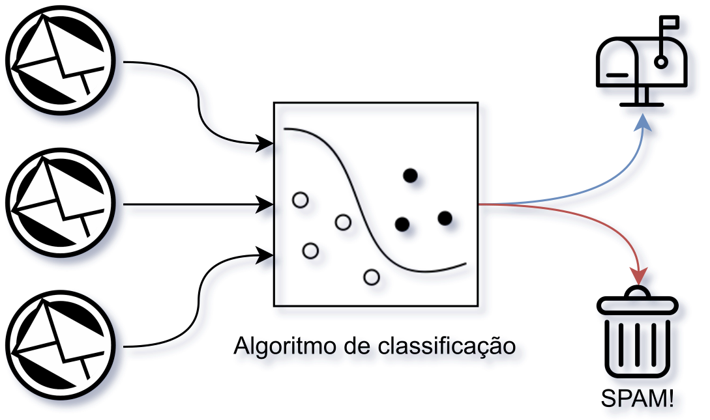
```

Esta seção busca apresentar alguns dos principais algoritmos de ML supervisionado que podem ser utilizados para a realização das atividades de classificação. Serão apresentados os algoritmos `k-Nearest Neighbors` e `Árvore de Decisão`.

## *k*-Nearest Neighbors
[](https://www.kaggle.com/phelpsmemo/intro-ml-python-knn-worcap2020)

<!-- *"Você é definido pelas pessoas com quem anda"* - Adaptação de ditado popular -->

Para começar, o primeiro algoritmo que vamos tratar será o *k*-Nearest Neighbors (kNN), que através da análise de vizinhança de amostras de um determinado conjunto de treinamento, define o rótulo das amostras do conjunto de teste. De maneira geral, o que o algoritmo faz é buscar os elementos que estão próximos à amostra que está sendo classificada, e com base nessas amostras que estão próximas faz a classificação. Então, aqui temos uma mistura de conceitos, vamos começar primeiro resumindo o algoritmo em uma frase:

> Me diga com quem tu andas, que eu digo quem tu és

Essa frase ajuda muito a assimilar a ideia geral do algoritmo, mantenha ela em mente durante essa seção. Agora, precisamos entender que o kNN é dividido em duas partes principais: (i) Análise de vizinhança; (ii) Determinação do rótulo da classe. Vamos começar pela primeira parte.

- (i) Análise de vizinhança; 

Nesta parte do algoritmo o que se busca é determinar quem são as amostras do conjunto de treinamento que estão mais próximas da amostra de teste que está sendo classificada. Mas nesse caso, o que é "estar próximo" ? De maneira intuitiva, a ideia de proximidade está relacionada a distância, e é exatamente dessa forma que o algoritmo, faz a determinação dos elementos próximos, para isso, utiliza várias funções de distância. Um exemplo de função de distância é a `Distância Euclidiana`, sim! a mesma que utilizamos para várias partes de nossas vidas para manipulação de elementos no espaço euclidiano. Você lembra que usamos ela para calcular a distância entre dois pontos ? Vamos olhar para relembrar

Então, a `Distância euclidiana` é apresentada da seguinte forma

\begin{equation} 
   \sqrt{\sum_{i = 1}^{n} (p_i - q_i)^2}
(\#eq:disteuclid)
\end{equation}

Em que:
   
   $p_i =$ Posição de uma determinada dimensão dos pontos
   
   $q_i =$ Posição de outra dimensão que não a tratada em $p_i$
   
Assim, através dessa função o algoritmo determina os elementos que estão mais próximos de uma determinada amostra. Cabe lembrar que, essa não é a única função, várias outras podem ser utilizadas. Agora, podemos ir para a segunda parte, vamos lá!

- (ii) Determinação do rótulo da classe.

> Para entender esta segunda parte, devemos nos lembrar que, esse algoritmo é um algoritmo supervisionado, então, quando estamos falando do conjunto amostral de treino, estamos assumindo que esses dados já possuem um rótulo definido e que esses rótulos serão utilizados no processo de classificação dos dados que não tem rótulo. Feito esse lembrete, vamos continuar!

Nesta parte do algoritmo, após calcular a distância de cada um dos pontos, ele escolhe os *k* elementos mais próximos. Com a determinação desses elementos mais próximos, o algoritmo analisa e contabiliza, por classe, quantos são os elementos que compõem a vizinhança, dessa forma, ao final desse processo, o algoritmo sabe quais são as classes vizinhas da amostra a ser classificada e quantos elementos de cada uma dessas classes estão presentes na vizinhança. Feito isso, o algoritmo vai determinar o rótulo da amostra a ser classificada como sendo igual a classe, que na vizinhança possui a maior quantidade de elementos. Somente isso! Viu que interessante, esse é um algoritmo simples e que pode ser muito eficiente dependendo do contexto de uso. 

Mas espera aí, você pode estar se perguntando, "E a ideia do treino e teste que foi falada antes?", bem, esse é um algoritmo de classificação *lazzy learning*, ou seja, a parte de treinamento é resumida em apenas organizar e armazenar os dados, de modo a deixar eles pronto para o uso.

Agora, com o objetivo de deixar tudo mais claro, vamos para um exemplo visual, passo a passo da execução do algoritmo! Então, vamos começar considerando que o nosso conjunto amostral é formado por um grupo de pontos de várias cores, em que as cores representam os rótulos de cada um desses pontos e então, a ideia vai ser aplicar o kNN para determinar o rótulo de um novo ponto com base nesse conjunto já existente.

> Veja, aqui que os pontos que já existem representam o conjunto de treino, e o ponto que será classificado, representa o conjunto de teste

Os pontos de treinamento são apresentados na Figura \@ref(fig:classKnn1).

```{r classKnn1, echo=FALSE, fig.align='center', out.width = "45%", fig.cap='Espaço euclidiano 1 - Fonte: Produção do autor'}
knitr::include_graphics("assets/02_classification/1_knn/knn_01.png")
```

Beleza! Então, com esse conjunto de dados, vamos adicionar um novo ponto, este é representado pelo ponto vermelho na figura abaixo. Perceba que, este é uma amostra que representa o conjunto de teste, e que, ao ser inserido neste espaço, ele não possui nenhum rótulo definido.

```{r classKnn2, echo=FALSE, fig.align='center', out.width = "45%", fig.cap='Espaço euclidiano 2 - Fonte: Produção do autor'}
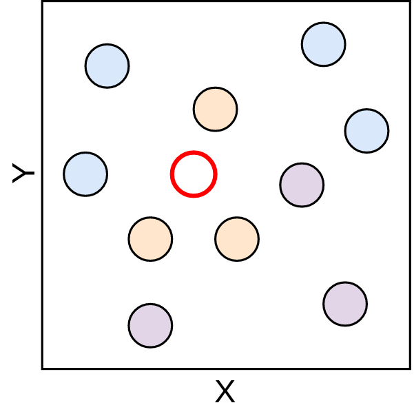
```

Certo! Então já temos nosso problema de classificação definido, vamos resolver ele com o kNN. Aqui, o valor de *k* = 5 (Não se preocupe, vamos voltar nesse valor de *k* depois), ou seja, vamos buscar os 5 elementos mais próximos ao ponto vermelho.

Feito essas considerações, vamos de maneira manual fazer a aplicação do algoritmo, começando com o primeiro passo, de análise de vizinhança, feito com o cálculo das distâncias. Aqui, você vai perceber que a distância utilizada foi a euclidiana, que apresentamos anteriormente.

```{r classKnn3, echo=FALSE, fig.align='center', out.width = "45%", fig.cap='Cálculo de distância - Fonte: Produção do autor'}
knitr::include_graphics("assets/02_classification/1_knn/knn_03.png")
```

Com as distâncias calculadas a segunda parte do algoritmo, de determinação do rótulo com base nos vizinhos pode ser iniciada. Para isso, primeiro faz-se a seleção dos 5 elementos mais próximos.

```{r classKnn4, echo=FALSE, fig.align='center', out.width = "45%", fig.cap='Seleção dos vizinhos mais próximos - Fonte: Produção do autor'}
knitr::include_graphics("assets/02_classification/1_knn/knn_04.png")
```

Com os vizinhos mais próximos determinados, é feito a contagem desses, separando cada um desses por rótulo, de modo que, a vizinhança é sumarizada em quantidade de elementos por rótulo, como apresentado na Figura \@ref(fig:classKnn5).

```{r classKnn5, echo=FALSE, fig.align='center', out.width = "70%", fig.cap='Contagem dos vizinhos mais próximos - Fonte: Produção do autor'}
knitr::include_graphics("assets/02_classification/1_knn/knn_05.png")
```

Então, é feita a determinação do rótulo do ponto que está sendo classificado, que como podemos ver, vai receber o rótulo laranja, uma vez que, esta é a classe que mais aparece na vizinhança do ponto vermelho.

```{r classKnn6, echo=FALSE, fig.align='center', out.width = "70%", fig.cap='Definição da classe - Fonte: Produção do autor'}
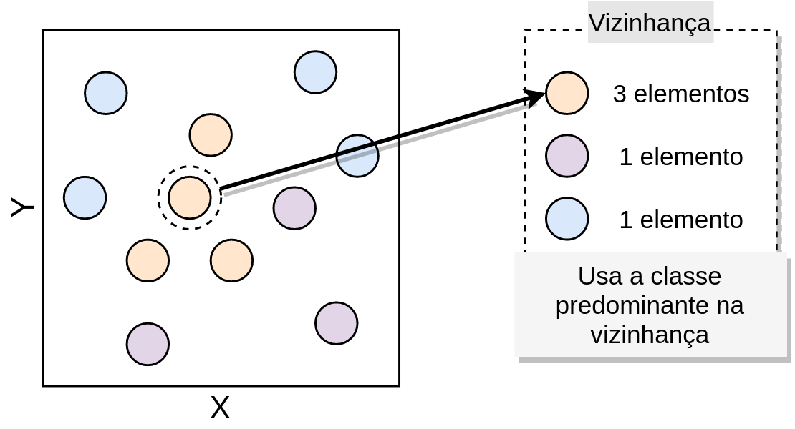
```

É desta forma que os passos que vimos do algoritmo kNN são materializados frente a um conjunto de dados. Viu, que legal! O que o algoritmo faz é exatamente aquilo que está na frase que apresentamos antes.

### Como determinar o valor de K ?

Legal! Então o algoritmo é simples de ser entendido, tem uma quantidade pequena de passos, todos compreensíveis. Mas uma pergunta pode ter surgido durante a explicação do algoritmo:

> Como determinar o valor de $K$ ?

Bem, essa é uma boa pergunta e mais que isso, é uma pergunta importante! Fazer a escolha da quantidade vizinhos que o kNN vai utilizar, determina o quão bem o algoritmo vai generalizar aos dados futuros. A escolha pelo valor de $K$ deve ser feita considerando um equilíbrio entre um valor grande ou pequeno, isso porque cada um deles tem influências diretas na maneira a qual o algoritmo vai reconhecer os dados [@lantz2013machine].

Segundo @lantz2013machine, quando valores muito grandes de $K$ são escolhidos, tem-se uma redução do impacto causado por dados ruidosos, mas, pode fazer com que o algoritmo deixe de considerar características sucintas que estão nos dados, mas que são importantes para a correta determinação dos rótulos. Por outro lado, valores de $K$ menores permitem o entendimento de características mais sofisticadas dos dados, mas sofrem muita influência de dados ruidosos. A Figura \@ref(fig:chooseKinKnn) faz uma representação da maneira como o processo de decisão para a determinação da classe pode ser tomado, neste, é possível perceber que os valores de $K$ .

```{r chooseKinKnn, echo=FALSE, fig.align='center', out.width = "70%", fig.cap='Definição da classe - Fonte: Adaptado de @lantz2013machine'}
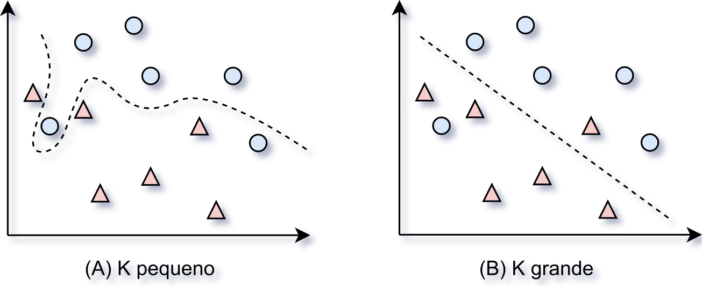
```

Desta forma, a determinação do valor de $K$ deve ser feita considerando os dados e as características que precisam ser mapeadas desses.

### Complexidade

Como você pode ter pensado, esse pode não ser um algoritmo computacionalmente muito barato, já que, o cálculo de distância nesse algoritmo que apresentamos, é sempre calculado entre todos os pontos do conjunto de treinamento com o conjunto de teste, o que se pensarmos em apenas poucas quantidades de pontos pode não ser um problema, mas que, com a crescente na quantidade, pode ser inviável. Para isso, considere a Figura \@ref(fig:classKnn7), imagina que o ponto vermelho vai ser classificado, a distância dele para todos os outros pontos terá de ser determinada.

```{r classKnn7, echo=FALSE, fig.align='center', out.width = "89%", fig.cap='Níveis de complexidade - Fonte: Produção do autor'}
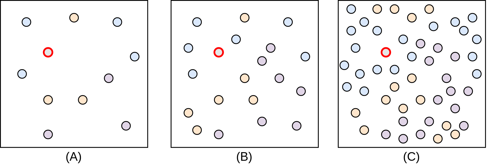
```

Como forma de reduzir essa complexidade e a quantidade de elementos que precisam ser contabilizados no cálculo da distância, várias implementações aplicam passos de indexação, com estruturas de dados como a KD-Tree e Quadtree, como é o caso do [scikit-learn](https://scikit-learn.org/). Essa abordagem de implementação evita com que todos os pontos tenham de ser calculados, possibilitando assim que apenas os pontos necessários sejam contabilizados nos cálculos de distância.

<!-- ### Exemplos -->

<!-- ToDo: Verificar e mover para a introdução -->
<!-- 
Como foi possível perceber o kNN é um algoritmo simples e pode ser implementado facilmente em linguagens como Python e R, mas, não há a necessidade da implementação do zero desse e dos demais algoritmos apresentados neste livro, há diversas bibliotecas que podem ser utilizadas para facilitar todo o processo aplicação do algoritmo. Assim, esta seção vai fazer o uso da biblioteca scikit-learn e do pacote class para realizar a aplicação do kNN.

Para começar, os dados utilizados estão disponíveis no arquivo knnpoints.csv e a visualização desses está disponível na Figura abaixo

<center>
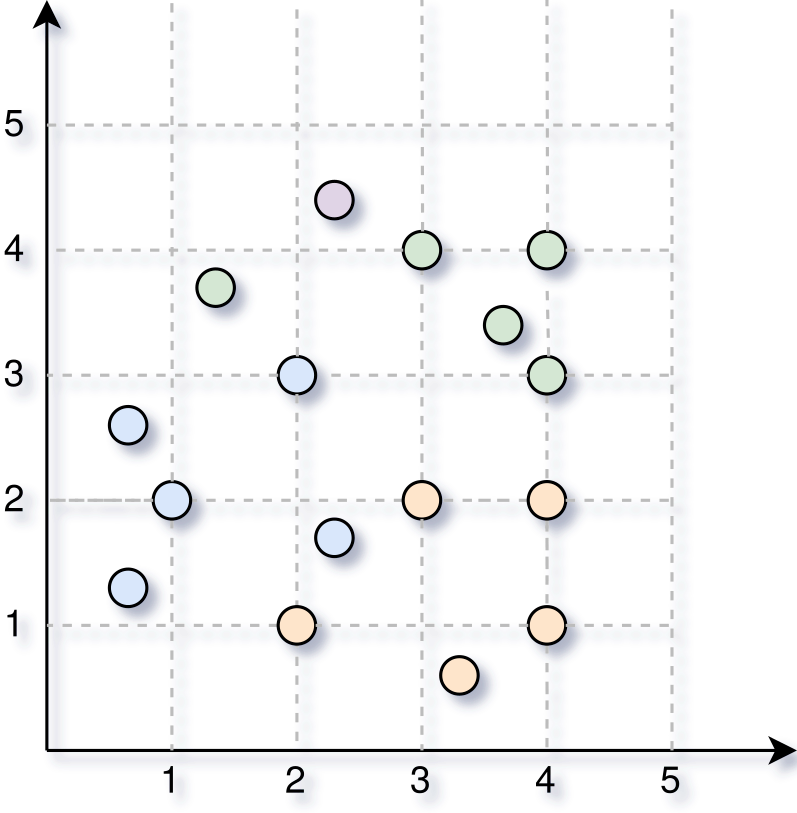
</center>

Abaixo é apresentado a maneira a qual o scikit-learn é importado para ser utilizado

```{python}
from sklearn.neighbors import KNeighborsClassifier
```

#### Exemplo 1

```{python}

```

<center>
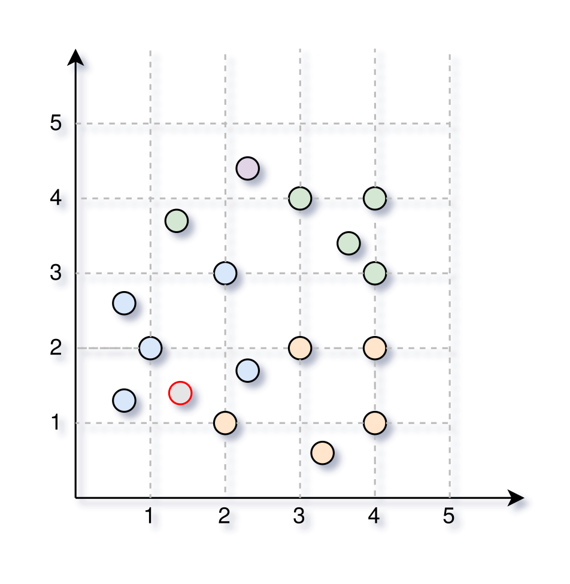
</center>

#### Exemplo 2

<center>

</center>

#### Exemplo 3

<center>

</center>
-->

<!-- ToDo: Adicionar três figuras nessa parte: (i) Pouca quantidade de pontos; (ii) Quantidade média de pontos; (iii) Grande quantidade de pontos -->
<!-- Isso ajuda a pessoa a entender a escala de crescimento da complexidade -->
<!-- Escolha do K -->
<!-- Visualização do funcionamento -->
<!-- Exemplos de uso  -->
  <!-- Páginas do Kaggle -->

## Árvore de decisão
[](https://www.kaggle.com/phelpsmemo/intro-ml-python-decisiontree-worcap2020)

<!-- *"O importante é não deixar de fazer perguntas"* - Albert Einstein -->

A árvore de decisão é um dos algoritmos mais utilizados na área de ML, isso por apresentar bons resultados em diversos contextos e por ser considerado um método *transparente*, por deixar explícito as regras que estão sendo utilizadas para a tomada das decisões e geração dos resultados. No capítulo anterior, esta classe de algoritmos foi apresentada para a solução dos problemas de regressão, aqui, eles serão postos no contexto de classificação.

### Conceitos gerais

As árvores de decisão são fundamentalmente formas de representação de conhecimento através de uma estrutura hierárquica de perguntas na forma *if-then-else*. Isso faz com que a estrutura das árvores de decisão sejam semelhantes a um fluxograma, em que existem nós que são utilizados para representar as perguntas e desses são derivados outros nós, que podem representar a resposta ou mesmo outra pergunta. Essa estrutura é apresentada na Figura \@ref(fig:classDt1).


```{r classDt1, echo=FALSE, fig.align='center', out.width = "75%", fig.cap='Árvore de decisão - Fonte: Produção do autor'}
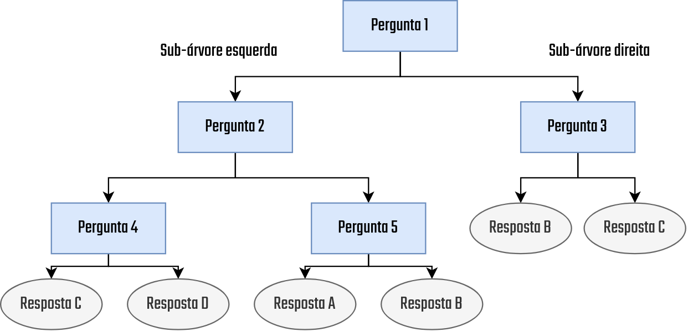
```

Para nos familiarizarmos com os conceitos que estão envolvidos nessa representação, vamos olhar com calma cada um dos detalhes presentes na figura. Primeiro, a leitura desse tipo de árvore é feita sempre de cima para baixo já que a raiz da árvore está sempre no topo, como é o caso da `Pergunta 1` neste exemplo. Além disso, note também que nessa estrutura existem dois tipos de elementos, as `Perguntas` e as `Respostas`, em que, das `Perguntas` podem sair outras dessas ou mesmo `Respostas`. As `Respostas` representam elementos finais e quando aparecem nada pode ser inserido abaixo. Outra coisa importante de ser citada é a característica recursiva das árvores de decisão, nessas, para cada ramo que é seguido após uma pergunta há uma nova árvore, que é criada através das mesmas regras de definição aplicadas na árvore anterior.

Antes da aplicação em larga escala dos algoritmos de AM, essas estruturas já eram utilizadas, porém, com a diferença de que toda a sua criação era feita manualmente, através da aplicação do conhecimento vindo de pesquisas e experimentos empíricos. Por exemplo, um banco, antes do ML, ao querer ser mais assertivo nos empréstimos e diminuir a inadimplência, poderia utilizar de seu histórico de empréstimos e criar regras consultáveis que poderiam ser utilizadas como auxílio aos operadores que realizam empréstimos. A representação das regras definidas poderia ser feita através de uma árvore de decisão sem problemas, mas, isso não caracterizada nada de ML, já que todo o 'processo de aprendizado' foi feito manualmente por pessoas.

Ao contrário disto, as árvores de decisão no contexto de ML são as responsáveis em olhar para os dados e decidir quais são as perguntas mais adequadas para uma determinada resposta. Isso é feito no algoritmo através de sucessivas divisões no conjunto de dados, de modo que, em cada divisão tem-se novos elementos adicionados na árvore. Para essa ideia ficar clara, vamos começar com um exemplo, neste, há um conjunto de pontos, em, cada cor representa uma classe. A árvore de decisão será treinada com esses dados de modo que novas classificações com base neste treinamento possam ser realizadas. O conjunto de dados e a representação da árvore são feitos na Figura \@ref(fig:classDt2).


```{r classDt2, echo=FALSE, fig.align='center', out.width = "75%", fig.cap='Conjunto de dados 1 - Fonte: Produção do autor'}
knitr::include_graphics("assets/02_classification/2_decision-tree/02_dt.png")
```

Com o conjunto de dados definido, o primeiro passo realizado pela árvore é avaliar quais são as características que melhor definem uma determinada classe. Após fazer isso, a árvore cria uma pergunta que faz com que essa característica identificada como a melhor possa ser utilizada para a divisão do conjunto de dados. Neste caso, a árvore identificou que o conjunto de pontos da classe `Vermelha` estão majoritariamente nas posições com X acima de 10, então, é criada uma pergunta na árvore que verifica quais elementos são maiores que dez, ao fazer isso a divisão do conjunto de dados é realizada e então novos nós são adicionados na árvore, veja na Figura \@ref(fig:classDt3).


```{r classDt3, echo=FALSE, fig.align='center', out.width = "75%", fig.cap='Conjunto de dados 2 - Fonte: Produção do autor'}
knitr::include_graphics("assets/02_classification/2_decision-tree/03_dt.png")
```


Se lembrarmos a definição feita anteriormente, temos que as árvores de decisão são estruturas recursivas, então, a mesma lógica de busca do elemento que melhor descreve um conjunto de dados e então a divisão é aplicado nos nós resultantes, isso é feito até que não haja mais elementos suficientes para a divisão ou quando em um nó todos os elementos pertencem a apenas uma classe. Na Figura \@ref(fig:classDt4) uma divisão é feita no nó esquerdo, gerado anteriormente, e no nó esquerdo não é feito mais nada.

```{r classDt4, echo=FALSE, fig.align='center', out.width = "79%", fig.cap='Conjunto de dados 3 - Fonte: Produção do autor'}
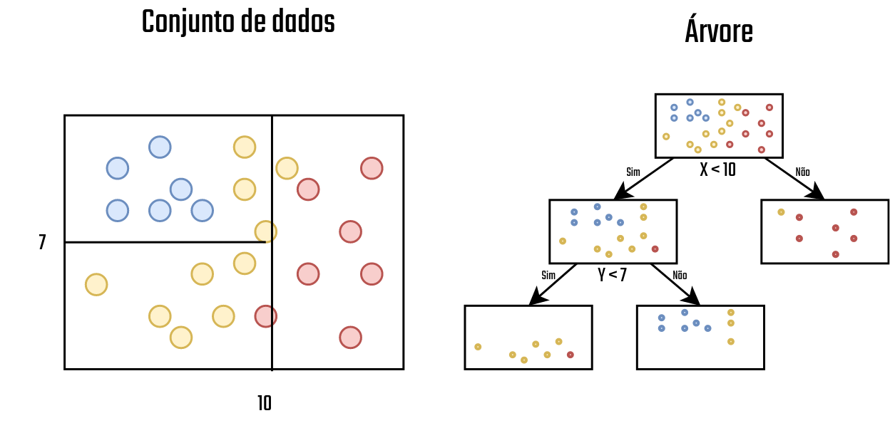
```
Vamos supor agora que a árvore apresentada na Figura \@ref(fig:classDt4) finalizou seu treinamento, de modo que classificações podem ser iniciadas. Você pode se perguntar, "mas em alguns nós da árvore há uma mistura de elementos, como ele vai fazer a identificação da classe ?" Bem, este é um problema recorrente na aplicação das árvores de decisão, nem sempre as regras escolhidas vão criar grupos de dados 100% puros (de uma única classe). Mais regras poderia ser adicionadas, mas aí, caímos no problema de *overfitting*, em que a árvore começa a criar regras específicas para os dados que estão sendo utilizados no treinamento, o que faz seu desempenho ser muito ruim com dados que não sejam do conjunto utilizado no treino. Com relação a definição da classe, é feito a definição da classe aos nós.

é definir a classe do nó gerado, considerando a classe mais representativa de cada nó, então, se formos classificar um novo ponto e ele tem X > 10, ele vai ser colocado como classe `Vermelha` no conjunto de dados.

Agora que temos uma visão geral do algoritmo, vamos dar ir adiante a frente e ver como os passos apresentados acima são feitos no algoritmo.

### Funcionamento

<!-- ToDo: Adicionar informação de que existem diversos algoritmos para a construção da árvore de decisão: ID3, CARTx... -->

Nesta seção, vamos materializar as ideias que foram apresentadas na seção de `Visão Geral`, descrevendo os passos envolvidos em cada uma das etapas do treinamento da árvore de decisão que foi apresentado anteriormente. Se lembrarmos dos passos que vimos anteriormente, temos que a criação da árvore ocorre em três etapas

- 1. Seleção do melhor atributo para a divisão dos registros
- 2. Utilização deste atributo para a divisão do conjunto de dados, gerando novos nós na árvore
- 3. Para cada nó gerado no passo 2, aplica-se recursivamente, o algoritmo de construção, iniciando no passo 1. O algoritmo deve parar a recursão e não dividir mais os nós quando: 
  - (i) Todos os dados do nó pertencerem a uma mesma classe; 
  - (ii) Não há dados suficientes para a divisão; ou 
  - (iii) Todos os atributos disponíveis nos dados já foram utilizados.

Agora, para que seja possível entender os conceitos utilizados na construção da árvore de decisão, vamos passar por cada um dos tópicos listados anteriormente.

#### Seleção do melhor atributo e divisão dos dados

Como foi apresentado na visão geral, a primeira etapa do algoritmo de criação de uma árvore de decisão é a seleção do atributo que melhor divide o conjunto de dados. Naquele caso, o algoritmo decidiu fazer o uso do atributo `X` como base para a divisão, considerando também que o valor deste deveria ser menor que 10. Ambas essas decisões foram tomadas seguindo alguns critérios, que ajudaram a definir as perguntas que melhor dividem os dados. Esses critérios são apresentados nessa seção.

Vamos começar com a seleção de atributos. Existem diversas métricas que podem auxiliar o algoritmo de criação da árvore de decisão a escolher os melhores atributos, sendo alguns deles o `Índice GINI` e o `Ganho de informação`. Neste documento, vamos considerar o uso da métrica de ganho de informação, neste, as divisões no conjunto de dados são feitas considerando a diminuição da entropia que esta vai causar no conjunto de dados.

Calma, eu sei, é muito coisa de uma vez só, mas vamos por partes. Primeiro, a entropia é um conceito utilizado para determinar o grau de desordem do conjunto de dados. Antes de apresentar a fórmula, vamos dar uma olhada em diferentes conjuntos de dados e seus níveis de entropia.


```{r classDt5, echo=FALSE, fig.align='center', out.width = "79%", fig.cap='Níveis de entropia - Fonte: Produção do autor'}
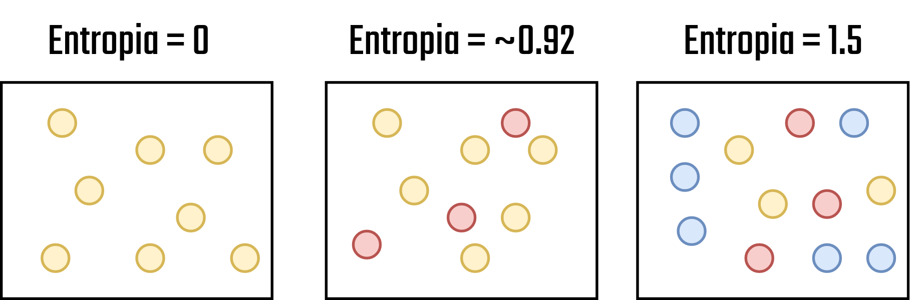
```

Perceba que, nos conjuntos de dados apresentados na Figura \@ref(fig:classDt5), quando menos mistura (Entenda como confusão neste caso) eu tenho no conjunto de dados, menor é a entropia do sistema. Então, a ideia base do ganho de informação é ir fazendo divisões de modo que os espaços resultantes da divisão tenham a menor entropia possível. Agora que já sabemos o que é, vejamos a fórmula da entropia:

\begin{equation} 
   E\:=-\:\sum _{i=1}^{^N}\left(p_i\cdot log_2\cdot p_i\right)\:
(\#eq:entropy)
\end{equation} 

Onde,

- $N$ = Quantidade total de elementos no conjunto de dados,
- $p_i$ = Probabilidade de aparição da classe $i$ no conjunto de dados

Usando dessas duas informações a entropia do sistema pode ser gerada! Bem, e o `Ganho de informação` ? Então, ele representa a vantagem que um determinado atributo tem de ser utilizado para a divisão, onde essa vantagem representa o grau de diminuição da entropia do conjunto de dados. O ganho de informação é definido como:

\begin{equation} 
   GI\left(Q\right)=E_0-\sum _{i=1}^q\left(\frac{N_i}{N}E_i\right)\:
(\#eq:informationgain)
\end{equation} 

Onde,

- $E_0$ = Entropia do nó pai (Nó atual)
- $E_i$ = Entropia do filho a ser gerado
- $q$ = Quantidade de nós filho
- $N$ = Quantidade total de elementos no conjunto de dados
- $N_i$ = Quantidade de dados a ser inserido no nó filho $i$

Uma vez tendo esses conceitos definidos, cabe deixar claro que, o ganho de informação será o elemento base utilizado no processo de seleção do atributo que melhor divide o conjunto de dados (que tem maior ganho de informação), e uma vez que este atributo é selecionado, ele passa a ser utilizado para a realização da divisão dos dados. Neste processo de divisão, mais passos podem ser considerados, mas o objetivo deste documento é de apenas apresentar a intuição geral por trás da árvore de decisão e seu processo de treinamento.

#### Exemplo de construção da árvore

Para fechar essa parte mais teórica do funcionamento da árvore de decisão e podermos iniciar a parte prática, vamos fazer um exemplo passo a passo da criação de uma árvore de decisão. Neste exemplo, vamos utilizar os dados que estão apresentados na tabela abaixo, esses que foram postos com valores categóricos de maneira a tornar mais simples todo o cálculo passo a passo que será realizado.

| Está chovendo ? | Está com tempo ? | Transporte (Classe) |
|:---------------:|:----------------:|:-------------------:|
|       Sim       |        Sim       |        Ônibus       |
|       Sim       |        Não       |        Ônibus       |
|       Não       |        Sim       |      Caminhada      |
|       Não       |        Não       |        Ônibus       |

Bom, nesta primeira etapa nossa árvore nem existe, é preciso definir para ela um ponto de partida, um atributo que será utilizada para dividir o conjunto de dados e então ir criando os ramos de decisão. Como vimos na seção anterior, vamos utilizar o `Ganho de informação` para realizar essa decisão. Então, para começar, vamos calcular o ganho de informação para cada um dos atributos, afinal, se quisermos saber qual a melhor, precisamos testar todas.

Para calcular o ganho de informação, precisamos primeiro calcular as entropias para os nós filhos que serão gerados caso este atributo seja o selecionado para a divisão. Para isso, aplicamos a divisão considerando o atributo e então, para cada nó gerado, calculamos a entropia. Por exemplo, no caso do atributo `Está chovendo?`, a divisão gerou dois nós. Um para o valor `Sim` e outro para o `Não`. Dentro desses dois nós é feita a inserção dos elementos correspondentes. No caso de quando `Está chovendo?` for `Sim`, o único transporte possível é o `Ônibus`, então, ele é o único inserido no nó resultante. O mesmo vale para quando a resposta é `Sim`, mas para esta resposta, são possíveis os transportes `Ônibus` e `Caminhada`. A Figura \@ref(fig:classDt6) apresenta a aplicação desta lógica em ambas os atributos (`Está chovendo?` e `Está com tempo?`)


```{r classDt6, echo=FALSE, fig.align='center', out.width = "100%", fig.cap='Entropia dos nós filhos - Fonte: Produção do autor'}
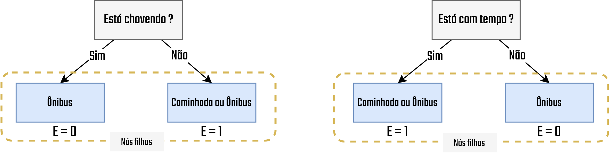
```

Com a entropia contabilizada para cada nó filho, de cada um dos atributos, o ganho de informação pode ser calculado. Vamos então começar calculando a entropia do nó pai, que como visto anteriormente, basicamente representa a entropia da divisão atual dos dados, que neste primeiro momento vai considerar todo o conjunto de dados. Lembre-se de que o cálculo é feito considerando o atributo de classe, neste caso `Transporte`.

\begin{equation} 
   E_0=-\left(\left(\frac{3}{4}\cdot log_2\frac{3}{4}\right)+\left(\frac{1}{4}\cdot log_2\frac{1}{4}\right)\right)\:\:\approx \:0.81
(\#eq:transport)
\end{equation} 

Beleza! Com isso calculado, vejamos o ganho de informação para cada atributo

<!-- ToDo: Validar -->
* `Está chovendo?`

\begin{equation} 
   GI\left(EstaChovendo?\right)\:=\:0.81\:-\:\sum _{n=1}^q\:\left(\frac{N_i}{N}E_i\right)=0.31
(\#eq:israining)
\end{equation} 

* `Está com tempo?`

\begin{equation} 
   GI\left(EstaComTempo?\right)\:=\:0.81\:-\:\sum _{n=1}^q\:\left(\frac{N_i}{N}E_i\right)=0.31
(\#eq:transport)
\end{equation} 

Opa! Olha que interessante, no final das contas os dois atributos tem a mesma quantidade de ganho de informação, o que indica que, ao selecionar um ou outro, a qualidade da divisão vai acabar sendo a mesma. Neste caso, outros critérios podem ser aplicados para o desempate, mas esses não serão tratados aqui. O ponto para este exercício é que, com os ganhos de informação calculados pode-se fazer a seleção do atributo para iniciar a divisão dos dados e assim começar a construção da árvore de decisão.

Bem, é basicamente assim que a árvore de decisão aprende, nos passos seguintes a este, utilizando a propriedade recursiva, citada anteriormente, estes passos vão sendo aplicados até atingir os critérios de parada já apresentados também. Com isso, você sabe agora o processo base que é utilizado para no processo de treinamento de uma árvore de decisão. Uma vez que a árvore é criada, é possível iniciar o processo de classificação dos dados, onde, as instâncias que precisam ser classificadas são colocadas na estrutura da árvore e então a classe é definida pela aplicação das regras, exatamente como vimos no exemplo de visão geral apresentado.

Acho que agora você consegue perceber o motivo deste ser um dos métodos de aprendizado de máquina mais utilizados que existe, sua simplicidade de implementação, interpretação junto a seu alto poder de generalização fazem com que este seja aplicado em diversos casos.

### Problemas com overfitting

Assim como qualquer outro algoritmo de ML supervisionado, as árvores de decisão podem sofrer com fenômeno de *Overfitting* e *Underfitting*. Com um algoritmo de treinamento que trabalha sempre com a melhora em cert, as árvores de decisão, no momento em que estão sendo geradas, podem acabar criando uma quantidade enorme de nós de decisão para minimizar a entropia de seus nós [@Aggarwal2015]. O contrário disso acaba gerando regras que não são o suficiente para caracterizar os dados e então generalizar as operações. A Figura \@ref(fig:classDtOverUnder) faz a ilustração desses fenômenos considerando a necessidade de identificação de um lenhador. 

```{r classDtOverUnder, echo=FALSE, fig.align='center', out.width = "70%", fig.cap='Representação do Overfitting e Underfitting - Fonte: Produção do autor'}
knitr::include_graphics("assets/02_classification/decisionoverfitting.png")
```

Note na Figura \@ref(fig:classDtOverUnder) que, para o caso de *Overfitting*, uma maior quantidade de regras vai ser gerada, fazendo com que a árvore de decisão aprenda sobre coisas que não são relevantes para a identificação, com o estilo do chapeu do lenhador. Por outro lado, no caso do *Overfitting*, tem-se que as regras criadas não conseguem capturar as informações úteis dos dados.

Para a solução deste problema, pode-se utilizar o processo de **Poda**, que não será tratado aqui. Caso tenha interesse, @Aggarwal2015, listou diversos algoritmos que podem ser utilizados neste processo.

<!-- ### Exemplos -->

<!-- Páginas do Kaggle -->
