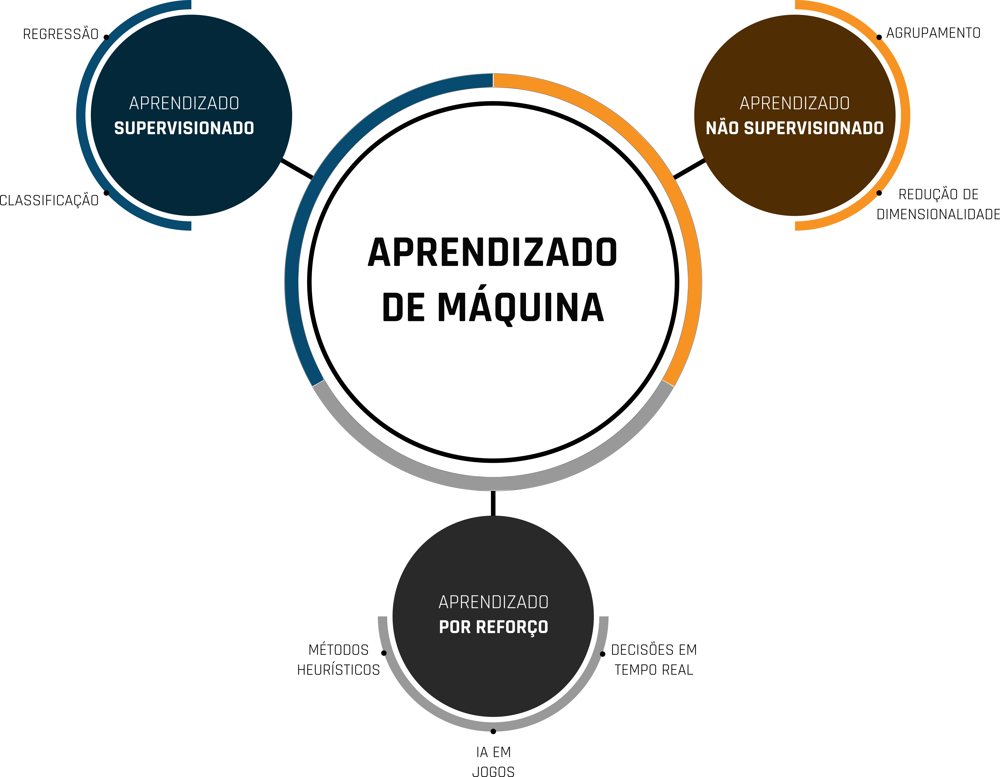

# (PART) Introdução {-}

# Introdução
> ***"As máquinas podem pensar?"***

A pergunta acima faz parte de um exercício teórico proposto pelo cientista da
computação Alan Turing em seu artigo publicado em 1950
[@turing1950computing]. Conhecido também como jogo da imitação, o teste de
Turing constitui, em sua concepção inicial, na interação entre três agentes: um
agente interrogador e dois agentes respondentes, onde um dos agentes respondentes
é um ser humano e outro uma máquina (computador). A pergunta enviada pelo agente
interrogador é recebida por ambos os agentes respondentes, onde cada um deles
devem enviar de volta a resposta. Com base nas respostas, o agente interrogador
deve determinar quem é o humano é que é a máquina, a partir do momento em que
esse agente não consegue mais fazer essa diferenciação, é dito que a máquina
passou no teste. A Figura \@ref(fig:turing-test-schema) mostra o esquema básico
desse teste.

```{r turing-test-schema, echo=FALSE ,fig.align="center", fig.cap='Esquema do teste de Turing clássico.'}
  knitr::include_graphics("assets/01_introduction/turing_test.png")
```

Diversas derivações deste teste surgiram posteriormente, o mais
famoso deles e familiar entre a maioria dos internautas é o CAPTCHA
(*Completely Automated Public Turing test to tell Computers and Humans Apart*),
mecanismo de segurança proposto por @von2003captcha para validar requisições
através da resolução de pequenos desafios, que podem ser identificação de
imagens ou textos distorcidos e com ruídos, e que tem como propósito dificultar
o acesso não convencional a formulários, por exemplo, tentar impedir o uso
*bots*.

O teste de Turing talvez tenha sido um ponto de partida para o que hoje
conhecemos por aprendizado de máquina (ML - sigla do inglês, *Machine Learning*)
. A possibilidade de representar pensamentos em computadores, similares aos dos
seres vivos foi um grande marco na humanidade. Atualmente esse conceito está
sendo aplicado nas mais diversas áreas, tendo em algumas tarefas, o desempenho
superior ao dos seres humanos. O próprio CAPTCHA é um exemplo disso, em algumas
de suas versões iniciais o conteúdo ficava tão distorcido, que acabava
dificultando a sua identificação pelos humanos, em contrapartida, os algoritmos
conseguiam resolver o desafio com certa facilidade.

Neste capítulo, será apresentada uma visão geral sobre o *Machine Learning*,
discorrendo sobre as principais classes de algoritmos e aplicações com ênfase na
área espacial. Ao final deste capítulo o leitor deverá ser capaz de:

- Compreender o contexto histórico e a definição do ML;
- Diferenciar as principais abordagens de treinamento dos modelos de ML;
- Diferenciar as principais classes de algoritmos de ML;
- Compreender as etapas mínimas necessárias para a produção de um modelo de ML;

## Machine learning
O aprendizado de máquina é uma das principais subáreas da inteligência artificial, e é composto por
uma coleção de métodos criados a partir de modelos matemáticos baseados na
teoria estatística que permitem aos computadores automatizar tarefas com base na
descoberta sistemática de padrões nos conjuntos de dados disponíveis ou em
experiências passadas [@bhavsar2017machine; @alpaydin2020introduction]. Segundo
a definição de @samuel1959some, um dos pioneiros do assunto, o aprendizado de
máquina é “*um campo de estudo que oferece aos computadores a capacidade de*
*aprender sem serem explicitamente programados*”. Segundo a definição de
@mitchell1997machine, é dito que *um computador aprende com a experiência $E$ a*
*respeito de alguma classe de tarefas $T$ e desempenho medido por $P$, se seu
desempenho nas tarefas em $T$, conforme medido por $P$, melhora com a
experiência $E$*, confuso? Então vamos a um exemplo:

Imagine que você está desenvolvendo um programa para prever o acumulado de
precipitação na próxima hora a partir de dados anteriores. A tarefa $T$ seria
estimar o acumulado de precipitação na próxima hora, a medida de desempenho $P$
poderia ser alguma métrica de erro, como a diferença entre o valor previsto e o
observado, já a experiência $E$ seria as várias tentativas de realizar a
previsão. O programa aprende à medida que sua previsão se aproxima do valor
observado durante suas experiências. A forma com que o programa aprende, está
associada a um conjunto de configurações previamente definidas, denominadas de
hiperparâmetros.

Inicialmente, há uma certa subjetividade envolvida na definição inicial dos
hiperparâmetros dos modelos, que ao longo do seu desenvolvimento vão sendo
ajustados em conformidade com os dados. O processo de ajuste dos hiperparâmetros
com o intuito de melhorar o desempenho do modelo é conhecido como *fine-tuning*.
O conjunto de hiperparâmetros está associado ao tipo de modelo que está sendo
desenvolvido, que por sua vez possuem características de aprendizado diferentes,
conforme mostrado na Figura \@ref(fig:ml-diagram).

```{r ml-diagram, out.width="90%", echo=FALSE ,fig.align="center", fig.cap='Diagrama dos tipos de aprendizado em machine learning.'}
  
```

### Aprendizado supervisionado
No aprendizado supervisionado, o modelo recebe um conjunto de entradas com suas
respectivas saídas e busca encontrar uma função que estabeleça uma relação
aproximada entre elas. Mais formalmente, o modelo baseado no
aprendizado supervisionado busca encontrar uma função $h(x_{i})$, denominada
hipótese, que se aproxime da função $f(x_{i})$, onde $f(x_{i})$ é a saída da
$i$-ésima entrada de $x$ [@norvig2002modern].

Os hiperparâmetros dos modelos baseados em aprendizado supervisionado são
configurados com intuito de calibrar seu nível de assertividade e precisão.
Essas características estão associadas ao *bias* e variância do modelo. O *bias*
está relacionado à capacidade do modelo se ajustar aos dados aos quais lhes
foram apresentados durante o treinamento. Já a variância é a variabilidade das
previsões do modelo. A complexidade do modelo aumenta a medida que ele vai
se ajustando aos dados, em contrapartida vai perdendo também a sua capacidade
de generalização, que faz com que variância seja aumentada. Os hiperparâmetros
devem ser configurados de tal forma equilibrar o *bias* e a variância, este
equilíbrio é denominado *trade-off*. Para modelos lineares, a complexidade do
modelo deve ser ajustada de tal forma que o *bias* e a variância tenham o menor
valor possível. Já para modelos não lineares, o ponto de equilíbrio deve ser
onde a complexidade do modelo possui o menor *bias* e maior variância. A Figura
\@ref(fig:trade-off) mostra um esquema para a complexidade ideal em modelos
lineares e não lineares.

```{r trade-off, out.width="90%", echo=FALSE ,fig.align="center", fig.cap='Esquema do *trade-off* no aprendizado supervisionado.'}
  knitr::include_graphics("assets/01_introduction/trade-off.png")
```

O ajuste desbalanceado da complexidade do modelo pode acarretar nos problemas de
*underfitting* (sub-ajuste) e o *overfitting* (superajuste). O problema de
*underfitting* está associado a falta de capacidade do modelo na representação
dos dados. Já no *overfitting* o modelo se ajusta muito aos dados e perde a
sua capacidade de generalização, que faz com que o erro seja muito alto ao ser
apresentado novas amostras. A Figura \@ref(fig:fitting) mostra um exemplo com
diferentes ajustes do modelo aos dados.

```{r fitting, out.width="90%", echo=FALSE ,fig.align="center", fig.cap='Diferentes ajustes do modelo aos dados.'}
  knitr::include_graphics("assets/01_introduction/fitting.png")
```

Os modelos de aprendizado supervisionado estão associados às tarefas de
regressão e classificação. Nas tarefas de regressão, o modelo deve buscar o
ajuste de uma função que melhor se aproxima os dados de entrada com os dados de
saída. Já os modelos de classificação buscam o ajuste em uma função que melhor
separe um conjunto de variáveis categóricas. Os modelos de regressão e
classificação são melhor apresentados neste livro nos capítulos
[2](https://dataat.github.io/introducao-ao-machine-learning/regress%C3%A3o.html)
e [3](https://dataat.github.io/introducao-ao-machine-learning/classifica%C3%A7%C3%A3o.html)
, respectivamente.

### Aprendizado Não supervisionado
O aprendizado não supervisionado, diferente do aprendizado supervisionado,
deve fazer inferências a partir de um conjunto de dados que não foi rotulado,
classificado ou categorizado previamente. Este tipo de aprendizado é amplamente
utilizado para a descoberta de padrões ocultos nos dados. Este tipo de abordagem
segue o fluxo apresentado na Figura \@ref(fig:ul).

```{r ul, echo=FALSE ,fig.align="center", fig.cap='Fluxo de execução do aprendizado não supervisionado.'}
  knitr::include_graphics("assets/01_introduction/unsupervised-learning.png")
```
As tarefas de agrupamento e redução de dimensionalidade estão entre as
principais tarefas executadas pelos algoritmos de aprendizado não
supervisionado. Essa abordagem também é amplamente utilizada para identificação
de anomalias nos dados.

Para as tarefas de agrupamento, o modelo recebe um conjunto de dados não
rotulado, e partir disso busca agrupá-lo com base em alguma característica de
similaridade, por exemplo, a distância entre os pontos. A quantidade de grupos
pode ser definida previamente, ou pode ficar a cargo do próprio modelo. Os
sistemas de recomendações, geralmente presentes na plataformas de
entretenimento, é uma das principais aplicações que utilizam essa abordagem. No
capítulo [4](https://dataat.github.io/introducao-ao-machine-learning/agrupamento.html)
deste livro as técnicas de agrupamento são apresentadas com mais detalhes.

A redução de dimensionalidade é uma técnica que utiliza o aprendizado não
supervisionado para a redução do número de variáveis. Essa técnica é utilizada
para encontrar um número inferior de variáveis que melhor representam as
características dos conjuntos de dados. Essa técnica é amplamente utilizada na
detecção de bordas, no contexto de processamento digital de imagens.

Por serem eventos raros, as anomalias podem ser difíceis de identificar,
principalmente em uma grande quantidade de dados. O aprendizado não
supervisionado pode ser utilizado na detecção dessas características. Uma das
tarefas em que pode ser aplicado esse recurso é na detecção de transações
fraudulentas. Além disso, a identificação de anomalias em um conjunto de dados,
pode afetar no treinamento de um modelo utilizando o aprendizado supervisionado,
agindo como ruído nos dados.

### Aprendizado por reforço
No aprendizado por reforço os modelos são treinados para tomarem uma sequência
de decisões e um ambiente incerto e complexo. Nessa abordagem, os agentes possuem
um estado que é alterado após realizar uma ação que é executada de forma
aleatória, com base nessa ação, os agentes podem ser penalizados ou
recompensados. Caso a ação do agente gere recompensas, então ela será
reforçada para o seu próximo estado [@goodfellow2016deep]. Nessa abordagem o
modelo pode utilizar a tentativa e erro de forma a maximizar suas recompensas. A
Figura \@ref(fig:rl) mostra o fluxo clássico da abordagem baseada no
aprendizado por reforço.

```{r rl, out.width="70%", echo=FALSE ,fig.align="center", fig.cap='Fluxo clássico do aprendizado por reforço.'}
  knitr::include_graphics("assets/01_introduction/rl.png")
```

O ambiente é o local em que o agente pode interagir tomando suas decisões. A
*priori* o agente não possui nenhuma informação a respeito do ambiente, mas ele
vai o conhecendo no decorrer de suas experiências para evoluir seus estados. O
estado diz respeito às condições atuais do agente e do ambiente. O estado do
agente é atualizado com base em suas recompensas ou penalidades que são
adquiridas após suas ações. As ações são as interações do agente com o
ambiente. A recompensa é um sinal positivo que é ativado reforçando uma ação do
agente, já penalidade, é um sinal negativo que faz com que a ação do agente seja
esquecida.

Esse tipo de abordagem é amplamente utilizada em jogos. Com base em suas
experiências, um agente agente pode aprender jogos com regras complexas como o
xadrez. Nesse caso, o ambiente é o tabuleiro de xadrez, o estado é o
posicionamento das peças, a ação é o movimento da peça, a recompensa é eliminar
uma peça adversária e a penalidade é a perda de uma peça após o movimento.

A aprendizado por reforço também está presente nos algoritmos dos veículos
autônomos. Onde, o ambiente é o próprio local onde o veículo está presente, o
estado é localização e percepção dos obstáculos capturadas pelos sensores, a
ação são os comandos de direção, aceleração e freio, a recompensa é a
a aproximação do destino e a penalidade pode ser a colisão com algum obstáculo.