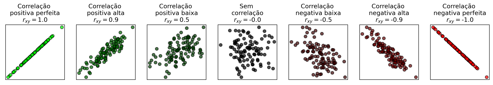
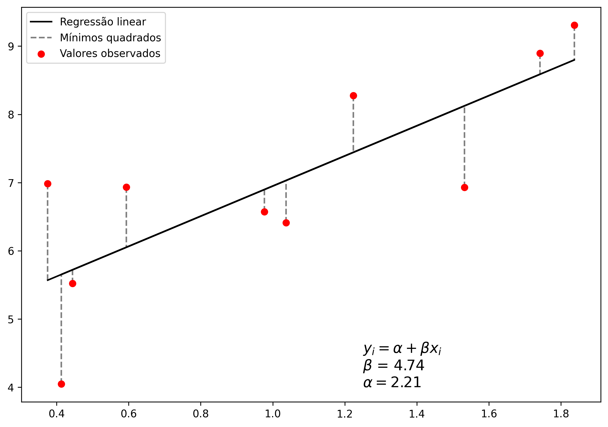
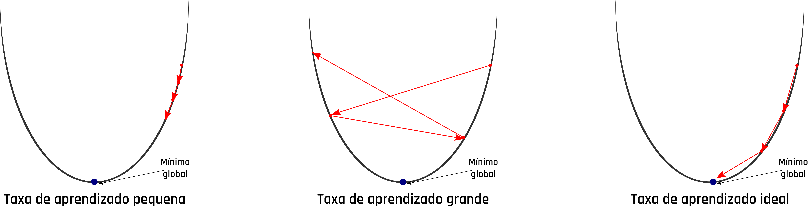
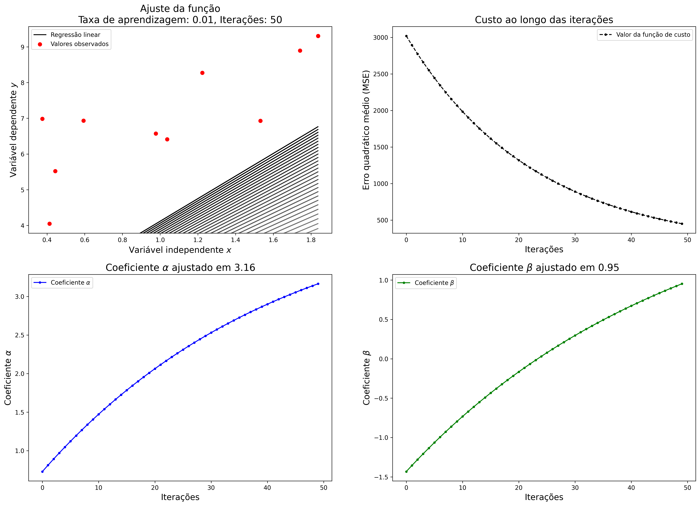
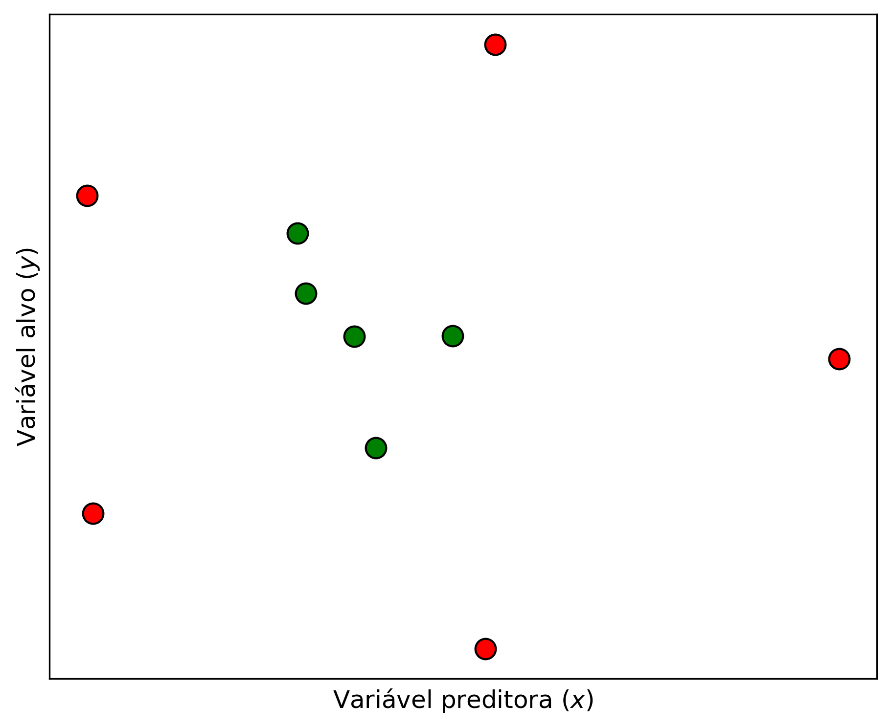
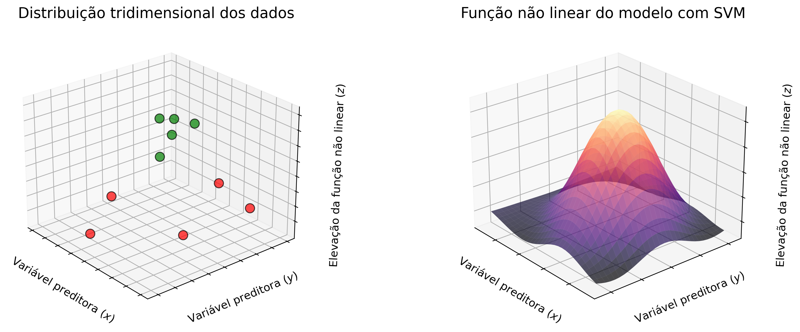

# (PART) Aprendizado Supervisionado {-}

# Regressão
Todas as pessoas pelo menos uma vez na vida já sentiu ou sentirá a necessidade 
de prever algum acontecimento futuro. Estamos a todo momento assimilando 
informações para realizar alguma tomada de decisão, seja de forma intrínseca ou 
não. No contexto de Machine Learning (ML) isso é feito pela técnicas de 
regressão. A regressão é uma ferramenta que busca modelar relações entre 
variáveis dependentes e independentes através de métodos estatísticos 
[@soto2013regression]. 

Uma variável independente, normalmente representada pela variável $x$, 
caracteriza uma grandeza que está sendo manipulada durante um experimento e que 
não sofre influência de outras variáveis. Já a variável dependente, normalmente 
representada pela variável $y$, caracteriza valores que estão diretamente 
associados à variável independente, ou seja, ao ser manipulada os valores 
variável independente, o valor das variáveis dependentes também sofrem 
alterações. Na Figura \@ref(fig:happinessWorld) é apresentada a relação entre a 
expectativa de vida baseada e um índice de felicidade calculado em diversos 
países obtidos a partir de um levantamento feito por @helliwell2020social. A 
variável independente nesse exemplo é representada pelo índice de felicidade e a 
expectativa de vida age como variável independente, dessa forma pode ser 
observada uma tendência de expectativa de vida maior em países com alto índice 
de felicidade, com uma força de correlação de 0,77. 

```{r happinessWorld, echo=FALSE, fig.align="center", fig.cap='Relação entre o índice de felicidade e expectativa de vida. Fonte: [@helliwell2020social]'}
  knitr::include_graphics("assets/03_regression/happiness_world.png")
```

As relações entre as variáveis dependentes e independentes são feitas através de 
algum coeficiente de correlação. Uma das métricas de correlação mais utilizadas 
é o coeficiente de Pearson, que mede a associação linear entre duas variáveis 
[@kirck2008pearson]. Esse coeficiente de correlação pode ser definido pela 
Equação \@ref(eq:corr-pearson), onde $n$ é o total de amostras, $\overline{x}$
e $\overline{y}$ são as médias aritméticas de ambas as variáveis. Os valores do 
coeficiente de Pearson variam entre -1 e 1, de tal forma que quanto mais 
próximos desses extremos, melhor correlacionado estão as variáveis. A Figura 
\@ref(fig:scatterCorrelations) mostra alguns exemplos com gráficos de dispersão 
de variáveis com diferentes correlações. 

\begin{equation} 
    r_{xy} = \frac{{}\sum_{i=1}^{n} (x_i - \overline{x})(y_i - \overline{y})}
    {\sqrt{\sum_{i=1}^{n} (x_i - \overline{x})^2(y_i - \overline{y})^2}}
(\#eq:corr-pearson)
\end{equation} 


```{r scatterCorrelations, echo=FALSE, fig.align="center", fig.cap='Diferentes correlações entre variáveis. Fonte: [@helliwell2020social]'}
  
```

Os métodos de regressão se utilizam dessas correlações entre as variáveis para 
estimar valores não existentes na amostra ou conjunto de dados. Entretanto, nem
sempre essas correlações são tão explícitas assim, sendo necessário outras 
abordagens mais robustas para realizar as previsões. Em ML os modelos de 
regressão podem ser criados a partir de diversas abordagens, desde as mais 
simples com poucas configurações de parâmetros e de fácil interpretação do 
funcionamento, até as abordagens mais complexas. Os métodos de regressão 
abordados neste capítulo serão `Regressão linear`, 
`Máquina de vetores de suporte` e `Árvores de decisão`.

## Regressão Linear
[](https://www.kaggle.com/lordadriano/mc2-worcap-2020-linear-regression)

A regressão linear é um dos métodos mais intuitivos e utilizados para essa 
finalidade. Esses métodos são divididos em dois grupos, a regressão linear simples
(RLS) e regressão linear múltipla (RLM). A RLS tem como objetivo estabelecer uma
relação entre duas variáveis através de uma função, que pode ser definida por:

\begin{equation} 
    y_{i} = \alpha+\beta x_{i}
(\#eq:rls-function)
\end{equation} 

Onde $y_{i}$ é a variável alvo, $\alpha$ e $beta x_{i}$ são coeficientes 
calculados pela regressão, que representam o intercepto no eixo $y$ e inclinação 
da reta, respectivamente.

A RLM é semelhante semelhante à RLS, porém possui múltiplas variáveis 
preditoras, e pode ser definida por:

\begin{equation} 
    y_{i} = \alpha+\beta x_{i1}+\beta x_{i2}+...+\beta x_{in}
(\#eq:rlm-function)
\end{equation} 

Onde $y_{i}$ é a variável alvo, $\alpha$ continua sendo o coeficiente de 
intercepto e $\beta x_{ip}$ o é coeficiente angular da $p$-ésima variável. Ambos 
os métodos podem ainda serem somados a um termo $\epsilon$ de erro. 

### Coeficientes da regressão linear

Existem diversas abordagens para se calcular os coeficientes $\alpha$ e $\beta$ 
da equação da regressão linear, as técnicas baseadas em mínimos quadrados 
ordinários e gradiente descendente são as mais comuns. A seguir serão 
apresentados os funcionamentos dessas abordagens.

#### Métodos dos quadrados ordinários

O Método dos quadrados ordinários (MQO) ou método dos mínimos quadrados (MMQ),
busca encontrar o melhor valor para os coeficientes citados anteriormente, de 
tal forma que a diferença absoluta entre o valor real e o predito pela função 
seja a menor possível entre todos os pontos. A Figura \@ref(fig:ols) mostra um 
exemplo de regressão linear utilizando o MQO para o conjunto pontos descritos na
tabela a seguir:

|	Variável independente	|	Variável dependente	|
|	0.44	|	5.52	|
|	1.74	|	8.89	|
|	0.41	|	4.05	|
|	1.84	|	9.31	|
|	0.98	|	6.57	|
|	1.22	|	8.27	|
|	1.53	|	6.93	|
|	1.04	|	6.41	|
|	0.59	|	6.93	|
|	0.38	|	6.98	|

```{r ols, echo=FALSE, fig.align="center", fig.cap='Exemplo do método dos quadrados ordinários.'}
  
```

Para se chegar no resultado apresentado na Figura \@ref(fig:ols), os 
coeficientes da regressão linear foram ajustados utilizando derivadas parciais, 
de tal tal forma que o erro quadrático médio entre entre a função e cada um dos 
pontos fossem a menor possível. A Figura \@ref(fig:ols-steps) mostra o ajuste 
dos coeficientes da equação em relação a cada ponto.

```{r ols-steps, echo=FALSE, fig.align="center", fig.cap='Ajuste da regressão linear por método dos quadrados ordinários.'}
  knitr::include_graphics("assets/03_regression/ols-steps.png")
```

#### Gradiente descendente
O método do gradiente descendente (GD) é uma das técnicas mais utilizadas para 
otimização de modelos de ML. Este é um método interativo que busca encontrar os 
coeficiente $\alpha$ e $\beta$ através da minimização de uma função de custo, 
que normalmente é o erro quadrático médio (MSE - sigla do inglês, 
*mean squared error*).

O GD funciona de forma iterativa e inicializa os coeficientes com um valor 
predefinido ou aleatório. Em cada iteração é obtido o somatório do erro entre 
todos os valores das variáveis dependentes e valores calculados pela função. Com
base nesse erro e em uma taxa de aprendizagem do modelo pré definida, os valores
dos coeficientes da função são atualizados para a próxima iteração. A taxa de 
aprendizagem deve ser definida com um valor equilibrado. A definição de um valor 
muito alto para a taxa de aprendizagem pode levar o modelo a cair em um mínimo 
local, ou seja, o modelo não consegue chegar em seu melhor ajuste. Já quando a 
taxa de aprendizagem é definida com um valor muito baixo, o modelo demora mais 
tempo para chegar no ajuste ideal, necessitando de muito mais tempo e 
processamento até que haja a convergência. A Figura \@ref(fig:learning-rate) 
mostra o comportamento do GD com diferentes categorias de valores mencionadas 
para a taxa de aprendizagem.

```{r learning-rate, echo=FALSE, fig.align="center", fig.cap='Problemas na taxa de aprendizado do gradiente descendente.'}
  
```

Os principais parâmetros a serem definidos nessa abordagem são a taxa de 
aprendizagem e o número de iterações. Considerando os pontos utilizados no 
exemplo anterior, foi aplicada a regressão linear utilizando o GD como método de 
atualização dos coeficientes. A Figura \@ref(fig:gd-example1) mostra o ajuste da 
função, custo e os coeficientes $\alpha$ e $\beta$ ao longo de 50 iterações com 
taxa de aprendizado muito baixa. Nessa figura pode ser observado que as 
iterações finalizam antes da convergência do modelo. 

```{r gd-example1, echo=FALSE, fig.align="center", fig.cap='Regressão linear com taxa de aprendizagem baixa no gradiente descendente.'}
  
```

Como mencionado anteriormente, uma taxa de aprendizagem muito grande também 
interfere no ajuste dos coeficientes, uma vez o modelo não consegue atingir o 
mínimo global. A Figura \@ref(fig:gd-example2) mostra o resultado da execução da
regressão linear utilizando uma taxa de aprendizagem muito grande no GD.

```{r gd-example2, echo=FALSE, fig.align="center", fig.cap='Regressão linear com taxa de aprendizagem alta no gradiente descendente.'}
  knitr::include_graphics("assets/03_regression/gradient-descendent-large.png")
```

Já com uma taxa de aprendizagem equilibrada, o GD é capaz de ajustar os 
coeficientes de forma mais eficiente. A Figura  \@ref(fig:gd-example3) mostra
o resultado do algoritmo executado com uma taxa de aprendizagem mais 
equilibrada. Como os valores iniciais dos coeficientes são definidos de forma 
aleatória, nas primeiras iterações o gradiente apresenta uma alta perturbação, 
que vai se atenuando ao longo das épocas.

```{r gd-example3, echo=FALSE, fig.align="center", fig.cap='Regressão linear com taxa de aprendizagem equilibrada no gradiente descendente.'}
  knitr::include_graphics("assets/03_regression/gradient-descendent.png")
```

Para dados com poucas dimensões, ou seja, poucas variáveis preditoras, o MQO é 
mais recomendado, pois diferente do GD, não é um algoritmo interativo, e sua
complexidade está associada diretamente à quantidade de pontos. Já o GD tem 
melhor performance quando os dados possuem muitas dimensões.

A regressão linear pode ser aplicada em uma vasta variedade de problemas, mas 
como foi apresentado ao longo desta seção, é necessário que os dados possuam uma 
alta correlação. Este algoritmo está disponível na biblioteca [Scikit-learn](https://scikit-learn.org/stable/modules/generated/sklearn.linear_model.LinearRegression.html) 
para ser utilizado em Python. 

## Máquinas de vetores de suporte
[](https://www.kaggle.com/lordadriano/mc2-worcap-2020-svr)

As máquinas de vetores de suporte (SVM - sigla do inglês, 
*support vector machine*) são modelos de aprendizado de máquina supervisionado 
concebido a partir de um conceito inicialmente proposto por @vapnik1965class. 
As SVM podem ser utilizadas tanto para tarefas de classificação, quanto para 
tarefas de regressão, sendo uma ótima alternativa aos modelos de redes neurais 
artificiais profundas que exigem um custo computacional muito superior em dados 
com muitas dimensões. Outra vantagem na utilização dos modelos baseados em SVM é
que eles não são sensíveis aos *outliers*, ou seja, valores extremos não causam 
ruído no treinamento.

O funcionamento básico das SVM consiste em ajustar a equação de uma reta, 
denominada hiperplano de tal forma que a distância entre ela e os pontos com 
características diferentes seja maximizada. Um conjunto de $n$ pontos é definido
como $(\vec{x_{1}}, y_{1}), (\vec{x_{2}}, y_{2}), ..., (\vec{x_{n}}, y_{n})$, 
onde $\vec{x_{i}}$ são as variáveis independentes representadas por um vetor de 
$d$-dimensões e $y_{i}$ são as variáveis dependentes. A distância maximizada 
entre o hiperplano e as fronteiras são definidas como margens e os pontos que 
estão no limite dessa margem são os vetores de suporte. Esses componentes podem 
ser modelados da seguinte forma:

\begin{equation} 
    \vec{w}\cdot\vec{x}-b =
      \begin{cases}
        & -1, & \text{primeiro vetor de suporte} \\
        & 0, & \text{hiperplano} \\
        & 1, & \text{segundo vetor de suporte}
      \end{cases}
(\#eq:svm-components)
\end{equation} 

Onde $\vec{w}$ é um vetor perpendicular aos pontos, $\vec{x}$ é o vetor do 
conjunto de pontos é $b$ é uma constante opcional que pode ser usada como uma 
*bias*. Quando o resultado dessa equação é igual a $1$ ou $-1$ trata-se de um 
dos vetores de suporte, quando o resultado é um valor maior que $0$ é menor que 
$1$ ou menor que $0$ e maior que $-1$ trata-se de um espaço da margem. A Figura 
\@ref(fig:linear-svm) mostra um exemplo da aplicação do algoritmo SVM em um 
conjunto de dados linearmente separáveis. Nessa figura, o hiperplano é 
caracterizado pela linha contínua, os vetores de suporte são as linhas 
tracejadas que interceptam os pontos com contorno destacado, e o espaço entre 
eles são as margens.

```{r linear-svm, echo=FALSE, fig.align="center", fig.cap='SVM para conjunto de dados linearmente separáveis.'}
  knitr::include_graphics("assets/03_regression/linear-svm.png")
```

As primeiras versões das SVM eram limitadas somente para resolução de problemas 
linearmente separáveis, como mostrado no exemplo anterior, mas a grande maioria
dos problemas não são linearmente separáveis. Considerando a Figura 
\@ref(fig:kernels-problem) é muito difícil traçar um hiperplano que separe bem 
os pontos de cores diferentes. Uma alternativa para esse problema é aumentar as 
dimensões para a representação do hiperplano. Essa tarefa é feita com a 
introdução de um conceito definido *kernel*.

```{r kernels-problem, echo=FALSE, fig.align="center", fig.cap='Conjunto de dados não linearmente separáveis.'}
  
```

Ao traçar um hiperplano não linear com a utilização de *kernels* é possível 
ajustar melhor os vetores de suporte aos dados. A Figura \@ref(kernels) mostra o 
conjunto de dados ajustado com hiperplanos lineares e não lineares.

```{r kernels, echo=FALSE, fig.align="center", fig.cap='Hiperplanos utilizando *kernels* com funções lineares e não lineares.'}
  knitr::include_graphics("assets/03_regression/kernels.png")
```

A abordagem utilizando os *kernels* é uma das principais características desse 
modelo de ML, pois faz com que o hiperplano seja ajustado em uma dimensão 
superior, utilizando equações de polinômios de maior grau. A Figura 
\@ref(fig:kernels-plot) mostra graficamente como é realizada essa manipulação. 

```{r kernels-plot, echo=FALSE, fig.align="center", fig.cap='Representação gráfica dos dados e da função não linear.'}
  
```

A utilização de *kernels* é uma das principais características do SVM e faz com 
que os modelos baseados nessa abordagem, sejam tão robustos quanto outras 
técnicas mais complexas.

### *Kernels*
A utilização dos *kernels* em SVM foram introduzidos por @boser1992training. 
Esses componentes *kernels* são responsáveis por criar uma transformação dos 
dados a partir de uma função, que são responsáveis por maximizar as margens dos 
vetores de suporte. A maioria das bibliotecas de ML, já possuem *kernels* 
implementados e também permitem a integração de outras funções customizadas. A 
lista a seguir apresenta brevemente alguns dos principais *kernels* 
utilizados.

- **Linear: ** Como mencionado anteriormente, é eficiente somente para problemas 
linearmente separáveis, uma vez que seu ajuste se da através da equação de uma 
reta. O *kernel* linear é definido apenas pelo produto entre duas amostras 
$\vec{x_{i}}$ e $\vec{x_{j}}$:

\begin{equation} 
    k(\vec{x_{i}}, \vec{x_{j}}) = \vec{x_{i}} \cdot \vec{x_{j}}
(\#eq:linear-kernel)
\end{equation} 

- **Polinomial: ** Os *kernels* polinomiais popularmente utilizados em tarefas 
de processamento de imagens, permitem adicionar curvas aos hiperplanos. Além das
amostras $\vec{x_{i}}$ e $\vec{x_{j}}$, o *kernel* polinomial também recebe o 
a variável $d$ que indica o seu grau, como definido pela equação:

\begin{equation} 
    k(\vec{x_{i}}, \vec{x_{j}}) = (\vec{x_{i}} \cdot \vec{x_{j}} + 1)^{d}
(\#eq:polynomial-kernel)
\end{equation} 

- **Função gaussiana de base radial: ** Os *kernels* RBF 
(*radial basis function*), como também são chamados, são recomendados quando não 
se tem um conhecimento prévio acerca dos dados. Esse *kernel* realiza uma 
transformação dos pontos utilizando uma função gaussiana, definida por:

\begin{equation} 
    k(\vec{x_{i}}, \vec{x_{j}}) = exp \left(-\frac{\lVert\vec{x_{i}} - \vec{x_{j}}\rVert^2}{2\sigma^2} \right)
(\#eq:rbf-kernel)
\end{equation} 

### Regressão com máquinas de vetores de suporte
Embora as SVM sejam aplicadas principalmente para tarefas de classificação, ou 
seja, um cálculo de um valor inteiro, ela também pode ser utilizada para tarefas 
de regressão, calculando valores reais. Essas abordagens são chamadas de 
regressão por vetores de suporte (SVR - sigla do inglês, 
*support vector regression*) e foram propostas por @drucker1997support. 
Diferente de modelos tradicionais como as técnicas de regressão apresentadas na 
seção anterior, que utilizam derivadas para os cálculos dos intervalos de 
confiança, no SVR os valores são previstos através dos hiperplanos.

Este método utiliza para a regressão a abordagem de classificação apresentada
anteriormente, porém com uma pequena variação na função objetivo, que agora 
busca comportar dentro das margens comportar a maior quantidade de pontos. As 
margens ($\epsilon$) representam os intervalos de confiança e os vetores de 
suporte que as delimitam, representam os limites para os erros positivos ($\xi$) 
e negativos ($\xi^{\ast}$). A Figura \@ref(fig:svr) mostra uma representação de 
um hiperplano não linear traçado para a regressão de dados.

```{r svr, echo=FALSE, fig.align="center", fig.cap='Representação de hiperplano não linear para regressão. Adaptado de @drucker1997support.'}
  knitr::include_graphics("assets/03_regression/svr.png")
```
